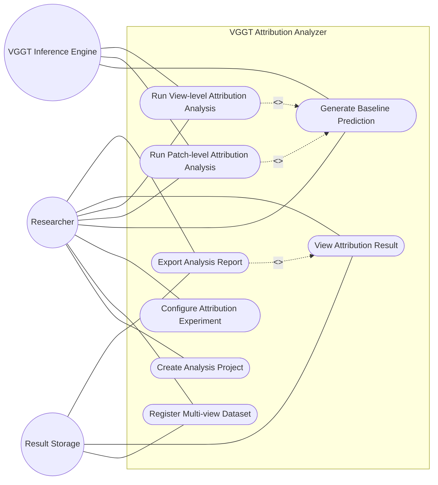
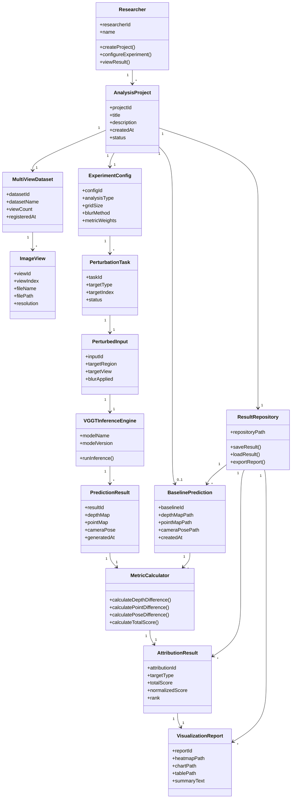

# VGGT Attribution Analyzer
## Analysis Document

**Student No.** [22112053]  
**Name** [최형규]  
**E-mail** [kgyu517@yu.ac.kr]  

**Project repository**  
[(https://github.com/tirano11/VGGT)]

\newpage

---

## Revision history

| Revision date | Version # | Description | Author |
|---|---:|---|---|
| 2026-06-05 | 1.0.0 | First draft of analysis document for VGGT-based 3D geometric prediction attribution analysis system | [최형규] |

---

## Contents

1. Introduction  
2. Use case analysis  
   2.1 Use case diagram  
   2.2 Use case description  
3. Domain analysis  
   3.1 Domain class diagram  
   3.2 Domain class description  
4. User Interface prototype  
5. Glossary  
6. References  

\newpage

---

# 1. Introduction

VGGT Attribution Analyzer는 순전파 기반 3차원 기하 비전 모델이 입력 영상의 어떤 국소 영역 또는 어떤 시점 영상에 의존하여 3차원 기하 예측을 수행하는지 분석하기 위한 소프트웨어 시스템이다. 최근 VGGT, DUSt3R, MASt3R와 같은 3차원 기하 비전 모델은 입력 영상으로부터 깊이 지도, 3차원 점 지도, 카메라 자세와 같은 기하 정보를 직접 예측할 수 있다. 이러한 모델은 전통적인 3차원 재구성 파이프라인보다 효율적으로 3차원 장면을 복원할 수 있지만, 모델이 어떤 입력 정보를 근거로 특정 예측 결과를 생성하는지는 명확하게 해석하기 어렵다.

본 시스템은 연구자 또는 개발자가 다중 시점 이미지 데이터셋을 등록하고, VGGT 모델의 기준 예측 결과를 생성한 뒤, 입력 영상의 특정 패치 또는 특정 시점 전체를 흐림 처리하여 교란 실험을 수행할 수 있도록 지원한다. 이후 원본 예측 결과와 교란 후 예측 결과 사이의 깊이 지도 변화량, 3차원 점 지도 변화량, 카메라 자세 변화량을 계산하여 각 입력 요소의 기여도 점수를 산출한다. 이를 통해 사용자는 모델이 어떤 패치나 시점 영상에 더 크게 의존하는지 정량적으로 확인할 수 있다.

본 시스템의 핵심 특징은 세 가지이다. 첫째, 입력 영상의 국소 영역을 선택적으로 흐림 처리하여 패치 단위 기여도를 분석한다. 둘째, 입력 순서와 입력 개수를 유지한 상태에서 특정 시점 영상 전체를 흐림 처리하여 시점 단위 기여도를 분석한다. 셋째, depth map, 3D point map, camera pose의 변화량을 함께 고려하여 3차원 기하 예측에 적합한 기하 인식 기여도 점수를 제공한다.

이번 Analysis 문서에서는 Conceptualization 문서에서 정의한 요구사항을 바탕으로 VGGT Attribution Analyzer가 사용자에게 제공해야 하는 기능을 Use case 관점에서 구체화한다. 또한 시스템의 문제 영역에 존재하는 주요 개념 클래스를 도출하고, 사용자가 시스템을 이용하는 흐름을 바탕으로 예비 사용자 인터페이스를 제시한다. 이 문서의 목적은 VGGT Attribution Analyzer가 “어떻게 구현되는가”보다 “무엇을 해야 하는가”를 명확하게 분석하는 데 있다.

---

# 2. Use case analysis

## 2.1 Use case diagram

VGGT Attribution Analyzer의 주요 사용자는 다중 시점 이미지 기반 3차원 재구성 모델의 예측 근거를 분석하려는 Researcher이다. 사용자는 분석 프로젝트를 생성하고, 다중 시점 이미지 데이터셋을 등록한 뒤, 실험 설정을 입력한다. 시스템은 등록된 입력 영상을 기반으로 VGGT 기준 예측을 생성하고, 패치 단위 또는 시점 단위 흐림 교란 실험을 수행한다. 이후 원본 예측과 교란 후 예측 사이의 기하학적 변화량을 계산하여 기여도 결과를 시각화하고 보고서로 내보낸다.

이 시스템에서는 VGGT Inference Engine과 Result Storage를 보조 actor로 고려한다. VGGT Inference Engine은 입력 영상으로부터 depth map, 3D point map, camera pose를 예측하는 외부 모델 실행 주체이다. Result Storage는 이미지 데이터셋, 예측 결과, 기여도 점수, 그래프, 보고서 파일을 저장하고 불러오는 외부 저장소이다. 다만 패치 생성, 흐림 교란, 변화량 계산, 기여도 점수 산출 등은 시스템 내부의 처리 과정이므로 사용자가 인지하는 기능 단위인 attribution analysis use case 안에 포함되는 동작으로 정리하였다.

### Use case diagram



## 2.2 Use case description

---

## Use Case #1 : Create Analysis Project

### GENERAL CHARACTERISTICS

| Item | Description |
|---|---|
| Summary | 사용자가 VGGT 기여도 분석을 수행하기 위한 새 분석 프로젝트를 생성하는 기능 |
| Scope | VGGT Attribution Analyzer |
| Level | User level |
| Author | [최형규] |
| Last Update | 2026-06-05 |
| Status | Analysis |
| Primary Actor | Researcher |
| Secondary Actor | Result Storage |
| Preconditions | 시스템이 실행되어 있어야 하며, 사용자는 분석 프로젝트를 생성할 수 있는 상태여야 한다. |
| Trigger | 사용자가 메인 화면에서 New Project 버튼을 누를 때 |
| Success Post Condition | 새 분석 프로젝트가 생성되고, 사용자는 데이터셋 등록 단계로 이동할 수 있다. |
| Failed Post Condition | 분석 프로젝트가 생성되지 않는다. |

### MAIN SUCCESS SCENARIO

| Step | Action |
|---:|---|
| 1 | 이 use case는 사용자가 새로운 3차원 기하 예측 기여도 분석을 시작하려고 할 때 시작된다. |
| 2 | 사용자는 메인 화면에서 New Project 버튼을 누른다. |
| 3 | 시스템은 프로젝트 이름, 설명, 분석 대상 모델 정보를 입력하는 화면을 표시한다. |
| 4 | 사용자는 프로젝트 이름과 간단한 설명을 입력한다. |
| 5 | 사용자는 분석 대상 모델로 VGGT를 선택한다. |
| 6 | 시스템은 입력 정보를 확인하고 새 분석 프로젝트를 생성한다. |
| 7 | 시스템은 생성된 프로젝트를 Result Storage에 저장한다. |
| 8 | 이 use case는 프로젝트가 정상적으로 생성되면 종료된다. |

### EXTENSION SCENARIOS

| Step | Branching Action |
|---|---|
| 4a | 필수 입력값이 누락된 경우 |
| 4a1 | 시스템은 프로젝트 이름을 입력하라는 메시지를 표시한다. |
| 4a2 | 사용자는 누락된 정보를 다시 입력한다. |
| 7a | 프로젝트 저장에 실패한 경우 |
| 7a1 | 시스템은 프로젝트를 저장할 수 없다는 메시지를 표시한다. |
| 7a2 | 시스템은 프로젝트 생성 화면을 유지한다. |

### RELATED INFORMATION

| Item | Description |
|---|---|
| Performance | 프로젝트 생성 화면은 1초 이내에 표시되어야 한다. |
| Frequency | 사용자가 새로운 분석 프로젝트를 시작할 때마다 발생한다. |
| Concurrency | 단일 사용자 기준 하나의 프로젝트 생성 작업을 수행한다. |
| Due Date | 2026-05-01 |

---

## Use Case #2 : Register Multi-view Dataset

### GENERAL CHARACTERISTICS

| Item | Description |
|---|---|
| Summary | 사용자가 VGGT 분석에 사용할 다중 시점 이미지 데이터셋을 등록하는 기능 |
| Scope | VGGT Attribution Analyzer |
| Level | User level |
| Author | [최형규] |
| Last Update | 2026-06-05 |
| Status | Analysis |
| Primary Actor | Researcher |
| Secondary Actor | Result Storage |
| Preconditions | 분석 프로젝트가 생성되어 있어야 한다. |
| Trigger | 사용자가 프로젝트 화면에서 Dataset Register 버튼을 누를 때 |
| Success Post Condition | 다중 시점 이미지 데이터셋이 프로젝트에 등록된다. |
| Failed Post Condition | 데이터셋이 프로젝트에 등록되지 않는다. |

### MAIN SUCCESS SCENARIO

| Step | Action |
|---:|---|
| 1 | 이 use case는 사용자가 분석 대상 다중 시점 이미지 데이터를 등록하려고 할 때 시작된다. |
| 2 | 사용자는 Dataset Register 버튼을 누른다. |
| 3 | 시스템은 이미지 폴더 또는 이미지 파일 목록을 선택하는 화면을 표시한다. |
| 4 | 사용자는 다중 시점 이미지가 포함된 폴더를 선택한다. |
| 5 | 시스템은 선택된 폴더에서 이미지 파일 목록을 불러온다. |
| 6 | 시스템은 이미지 개수, 파일명, 입력 순서, 이미지 해상도 정보를 표시한다. |
| 7 | 사용자는 이미지 목록과 입력 순서를 확인한다. |
| 8 | 시스템은 데이터셋 정보를 프로젝트에 등록하고 Result Storage에 저장한다. |
| 9 | 이 use case는 데이터셋 등록이 완료되면 종료된다. |

### EXTENSION SCENARIOS

| Step | Branching Action |
|---|---|
| 4a | 사용자가 이미지가 없는 폴더를 선택한 경우 |
| 4a1 | 시스템은 등록 가능한 이미지가 없다는 메시지를 표시한다. |
| 4a2 | 시스템은 폴더 선택 화면으로 돌아간다. |
| 5a | 지원하지 않는 파일 형식이 포함된 경우 |
| 5a1 | 시스템은 지원하지 않는 파일을 제외하고 등록 가능한 이미지 목록을 표시한다. |
| 5a2 | 사용자는 제외된 파일 목록을 확인한다. |
| 8a | 데이터셋 저장에 실패한 경우 |
| 8a1 | 시스템은 데이터셋 저장 실패 메시지를 표시한다. |
| 8a2 | 시스템은 데이터셋 등록 화면을 유지한다. |

### RELATED INFORMATION

| Item | Description |
|---|---|
| Performance | 100개 이하의 이미지 목록은 3초 이내에 표시되어야 한다. |
| Frequency | 사용자가 분석 프로젝트마다 한 번 이상 수행할 수 있다. |
| Concurrency | 단일 프로젝트 기준 하나의 데이터셋 등록 작업을 수행한다. |
| Due Date | 2026-05-01 |

---

## Use Case #3 : Configure Attribution Experiment

### GENERAL CHARACTERISTICS

| Item | Description |
|---|---|
| Summary | 사용자가 패치 단위 또는 시점 단위 기여도 분석을 위한 실험 조건을 설정하는 기능 |
| Scope | VGGT Attribution Analyzer |
| Level | User level |
| Author | [최형규] |
| Last Update | 2026-06-05 |
| Status | Analysis |
| Primary Actor | Researcher |
| Preconditions | 분석 프로젝트와 다중 시점 데이터셋이 등록되어 있어야 한다. |
| Trigger | 사용자가 Experiment Configuration 화면을 열 때 |
| Success Post Condition | 실험 설정값이 프로젝트에 저장된다. |
| Failed Post Condition | 실험 설정값이 저장되지 않는다. |

### MAIN SUCCESS SCENARIO

| Step | Action |
|---:|---|
| 1 | 이 use case는 사용자가 기여도 분석 실험 조건을 설정하려고 할 때 시작된다. |
| 2 | 시스템은 실험 유형 선택 화면을 표시한다. |
| 3 | 사용자는 Patch-level analysis 또는 View-level analysis를 선택한다. |
| 4 | 사용자가 Patch-level analysis를 선택한 경우, 시스템은 grid size 선택 항목을 표시한다. |
| 5 | 사용자는 2x2, 4x4, 8x8 중 하나의 grid size를 선택한다. |
| 6 | 사용자가 View-level analysis를 선택한 경우, 시스템은 전체 시점 흐림 교란 설정을 표시한다. |
| 7 | 사용자는 depth map, 3D point map, rotation, translation 변화량에 대한 metric weight를 입력한다. |
| 8 | 시스템은 입력된 실험 설정을 검증한다. |
| 9 | 시스템은 실험 설정값을 프로젝트에 저장한다. |
| 10 | 이 use case는 실험 설정이 저장되면 종료된다. |

### EXTENSION SCENARIOS

| Step | Branching Action |
|---|---|
| 3a | 사용자가 실험 유형을 선택하지 않은 경우 |
| 3a1 | 시스템은 실험 유형을 선택하라는 메시지를 표시한다. |
| 7a | metric weight 값이 올바르지 않은 경우 |
| 7a1 | 시스템은 가중치 입력값이 잘못되었다는 메시지를 표시한다. |
| 7a2 | 사용자는 metric weight를 다시 입력한다. |
| 9a | 설정 저장에 실패한 경우 |
| 9a1 | 시스템은 실험 설정 저장 실패 메시지를 표시한다. |
| 9a2 | 시스템은 실험 설정 화면을 유지한다. |

### RELATED INFORMATION

| Item | Description |
|---|---|
| Performance | 실험 설정 화면은 1초 이내에 표시되어야 한다. |
| Frequency | 사용자가 실험 조건을 변경할 때마다 발생한다. |
| Concurrency | 단일 프로젝트 기준 하나의 활성 실험 설정을 관리한다. |
| Due Date | 2026-05-01 |

---

## Use Case #4 : Generate Baseline Prediction

### GENERAL CHARACTERISTICS

| Item | Description |
|---|---|
| Summary | 원본 다중 시점 이미지를 VGGT에 입력하여 기준 3차원 기하 예측 결과를 생성하는 기능 |
| Scope | VGGT Attribution Analyzer |
| Level | User level |
| Author | [최형규] |
| Last Update | 2026-06-05 |
| Status | Analysis |
| Primary Actor | Researcher |
| Secondary Actor | VGGT Inference Engine, Result Storage |
| Preconditions | 분석 프로젝트와 다중 시점 데이터셋이 등록되어 있어야 한다. |
| Trigger | 사용자가 Baseline Prediction 버튼을 누를 때 |
| Success Post Condition | 원본 입력에 대한 depth map, 3D point map, camera pose 기준 예측 결과가 생성된다. |
| Failed Post Condition | 기준 예측 결과가 생성되지 않는다. |

### MAIN SUCCESS SCENARIO

| Step | Action |
|---:|---|
| 1 | 이 use case는 사용자가 원본 입력에 대한 기준 예측을 생성하려고 할 때 시작된다. |
| 2 | 사용자는 Baseline Prediction 버튼을 누른다. |
| 3 | 시스템은 등록된 다중 시점 이미지 목록과 입력 순서를 확인한다. |
| 4 | 시스템은 원본 이미지 집합을 VGGT Inference Engine에 전달한다. |
| 5 | VGGT Inference Engine은 원본 이미지 집합에 대한 3차원 기하 예측을 수행한다. |
| 6 | 시스템은 depth map, 3D point map, camera pose 예측 결과를 수신한다. |
| 7 | 시스템은 기준 예측 결과의 생성 상태와 요약 정보를 화면에 표시한다. |
| 8 | 시스템은 기준 예측 결과를 Result Storage에 저장한다. |
| 9 | 이 use case는 기준 예측 결과가 정상적으로 저장되면 종료된다. |

### EXTENSION SCENARIOS

| Step | Branching Action |
|---|---|
| 3a | 등록된 데이터셋이 없는 경우 |
| 3a1 | 시스템은 데이터셋을 먼저 등록하라는 메시지를 표시한다. |
| 3a2 | 시스템은 Dataset Register 화면으로 이동한다. |
| 5a | VGGT Inference Engine 실행에 실패한 경우 |
| 5a1 | 시스템은 모델 추론 실패 메시지를 표시한다. |
| 5a2 | 시스템은 기준 예측 생성 상태를 Failed로 표시한다. |
| 8a | 기준 예측 결과 저장에 실패한 경우 |
| 8a1 | 시스템은 결과 저장 실패 메시지를 표시한다. |
| 8a2 | 시스템은 기준 예측 결과를 임시 결과로 표시한다. |

### RELATED INFORMATION

| Item | Description |
|---|---|
| Performance | 기준 예측 실행 시간은 입력 이미지 수와 GPU 상태에 따라 달라질 수 있으며, 진행률이 사용자에게 표시되어야 한다. |
| Frequency | 각 프로젝트에서 기준 예측이 없거나 입력 데이터가 변경될 때 발생한다. |
| Concurrency | 단일 프로젝트 기준 한 번에 하나의 기준 예측 작업을 수행한다. |
| Due Date | 2026-05-01 |

---

## Use Case #5 : Run Patch-level Attribution Analysis

### GENERAL CHARACTERISTICS

| Item | Description |
|---|---|
| Summary | 입력 영상의 특정 국소 영역을 흐림 처리하여 패치 단위 기여도 점수를 계산하는 기능 |
| Scope | VGGT Attribution Analyzer |
| Level | User level |
| Author | [최형규] |
| Last Update | 2026-06-05 |
| Status | Analysis |
| Primary Actor | Researcher |
| Secondary Actor | VGGT Inference Engine, Result Storage |
| Preconditions | 데이터셋, 실험 설정, 기준 예측 결과가 준비되어 있어야 한다. |
| Trigger | 사용자가 Run Patch Analysis 버튼을 누를 때 |
| Success Post Condition | 각 이미지 패치에 대한 기여도 점수와 heatmap 결과가 생성된다. |
| Failed Post Condition | 패치 단위 기여도 분석 결과가 생성되지 않는다. |

### MAIN SUCCESS SCENARIO

| Step | Action |
|---:|---|
| 1 | 이 use case는 사용자가 입력 영상의 국소 영역 단위 기여도를 분석하려고 할 때 시작된다. |
| 2 | 사용자는 Run Patch Analysis 버튼을 누른다. |
| 3 | 시스템은 기준 예측 결과가 존재하는지 확인한다. |
| 4 | 시스템은 사용자가 설정한 grid size에 따라 각 입력 영상을 패치 영역으로 분할한다. |
| 5 | 시스템은 하나의 패치 영역만 흐림 처리한 교란 입력을 생성한다. |
| 6 | 시스템은 교란 입력을 VGGT Inference Engine에 전달한다. |
| 7 | VGGT Inference Engine은 교란 입력에 대한 예측 결과를 생성한다. |
| 8 | 시스템은 원본 기준 예측 결과와 교란 후 예측 결과의 depth map, 3D point map, camera pose 차이를 계산한다. |
| 9 | 시스템은 해당 패치의 total score와 normalized score를 계산한다. |
| 10 | 시스템은 모든 패치에 대해 5단계부터 9단계까지 반복한다. |
| 11 | 시스템은 패치 단위 기여도 지도와 요약 표를 생성한다. |
| 12 | 시스템은 분석 결과를 Result Storage에 저장한다. |
| 13 | 이 use case는 패치 단위 기여도 결과가 정상적으로 생성되면 종료된다. |

### EXTENSION SCENARIOS

| Step | Branching Action |
|---|---|
| 3a | 기준 예측 결과가 없는 경우 |
| 3a1 | 시스템은 기준 예측을 먼저 생성해야 한다는 메시지를 표시한다. |
| 3a2 | 시스템은 Generate Baseline Prediction use case를 수행한다. |
| 4a | grid size가 설정되어 있지 않은 경우 |
| 4a1 | 시스템은 grid size를 선택하라는 메시지를 표시한다. |
| 4a2 | 시스템은 Experiment Configuration 화면으로 이동한다. |
| 7a | 특정 교란 입력에 대한 모델 추론이 실패한 경우 |
| 7a1 | 시스템은 해당 패치의 분석 상태를 Failed로 표시한다. |
| 7a2 | 시스템은 다음 패치 분석을 계속 수행한다. |
| 12a | 결과 저장에 실패한 경우 |
| 12a1 | 시스템은 결과 저장 실패 메시지를 표시한다. |
| 12a2 | 시스템은 생성된 결과를 임시 결과 화면에 표시한다. |

### RELATED INFORMATION

| Item | Description |
|---|---|
| Performance | 전체 실행 시간은 입력 이미지 수와 grid size에 비례하므로 진행률과 남은 작업 수가 표시되어야 한다. |
| Frequency | 사용자가 패치 단위 기여도를 분석할 때마다 발생한다. |
| Concurrency | 단일 프로젝트 기준 하나의 패치 분석 작업을 수행한다. |
| Due Date | 2026-05-01 |

---

## Use Case #6 : Run View-level Attribution Analysis

### GENERAL CHARACTERISTICS

| Item | Description |
|---|---|
| Summary | 특정 시점 영상 전체를 흐림 처리하여 시점 단위 기여도 점수를 계산하는 기능 |
| Scope | VGGT Attribution Analyzer |
| Level | User level |
| Author | [최형규] |
| Last Update | 2026-06-05 |
| Status | Analysis |
| Primary Actor | Researcher |
| Secondary Actor | VGGT Inference Engine, Result Storage |
| Preconditions | 데이터셋, 실험 설정, 기준 예측 결과가 준비되어 있어야 한다. |
| Trigger | 사용자가 Run View Analysis 버튼을 누를 때 |
| Success Post Condition | 각 시점 영상에 대한 기여도 점수와 시점 단위 분석 결과가 생성된다. |
| Failed Post Condition | 시점 단위 기여도 분석 결과가 생성되지 않는다. |

### MAIN SUCCESS SCENARIO

| Step | Action |
|---:|---|
| 1 | 이 use case는 사용자가 다중 시점 입력 영상 중 각 시점의 기여도를 분석하려고 할 때 시작된다. |
| 2 | 사용자는 Run View Analysis 버튼을 누른다. |
| 3 | 시스템은 기준 예측 결과가 존재하는지 확인한다. |
| 4 | 시스템은 등록된 다중 시점 이미지의 입력 순서를 확인한다. |
| 5 | 시스템은 하나의 시점 영상 전체를 흐림 처리한 교란 입력을 생성한다. |
| 6 | 시스템은 입력 영상의 개수와 순서를 유지한 상태로 교란 입력을 구성한다. |
| 7 | 시스템은 교란 입력을 VGGT Inference Engine에 전달한다. |
| 8 | VGGT Inference Engine은 교란 입력에 대한 예측 결과를 생성한다. |
| 9 | 시스템은 원본 기준 예측 결과와 교란 후 예측 결과의 depth map, 3D point map, camera pose 차이를 계산한다. |
| 10 | 시스템은 해당 시점 영상의 total score를 계산한다. |
| 11 | 시스템은 모든 시점 영상에 대해 5단계부터 10단계까지 반복한다. |
| 12 | 시스템은 시점별 기여도 그래프와 요약 표를 생성한다. |
| 13 | 시스템은 분석 결과를 Result Storage에 저장한다. |
| 14 | 이 use case는 시점 단위 기여도 결과가 정상적으로 생성되면 종료된다. |

### EXTENSION SCENARIOS

| Step | Branching Action |
|---|---|
| 3a | 기준 예측 결과가 없는 경우 |
| 3a1 | 시스템은 기준 예측을 먼저 생성해야 한다는 메시지를 표시한다. |
| 3a2 | 시스템은 Generate Baseline Prediction use case를 수행한다. |
| 4a | 등록된 시점 영상이 하나뿐인 경우 |
| 4a1 | 시스템은 시점 단위 분석을 위해 두 개 이상의 입력 영상이 필요하다는 메시지를 표시한다. |
| 4a2 | 시스템은 Dataset Register 화면으로 이동한다. |
| 8a | 특정 시점 교란 입력에 대한 모델 추론이 실패한 경우 |
| 8a1 | 시스템은 해당 시점의 분석 상태를 Failed로 표시한다. |
| 8a2 | 시스템은 다음 시점 분석을 계속 수행한다. |
| 13a | 결과 저장에 실패한 경우 |
| 13a1 | 시스템은 결과 저장 실패 메시지를 표시한다. |
| 13a2 | 시스템은 생성된 결과를 임시 결과 화면에 표시한다. |

### RELATED INFORMATION

| Item | Description |
|---|---|
| Performance | 전체 실행 시간은 입력 시점 수에 비례하므로 진행률이 사용자에게 표시되어야 한다. |
| Frequency | 사용자가 시점 단위 기여도를 분석할 때마다 발생한다. |
| Concurrency | 단일 프로젝트 기준 하나의 시점 분석 작업을 수행한다. |
| Due Date | 2026-05-01 |

---

## Use Case #7 : View Attribution Result

### GENERAL CHARACTERISTICS

| Item | Description |
|---|---|
| Summary | 사용자가 패치 단위 또는 시점 단위 기여도 분석 결과를 표, 그래프, heatmap 형태로 확인하는 기능 |
| Scope | VGGT Attribution Analyzer |
| Level | User level |
| Author | [최형규] |
| Last Update | 2026-06-05 |
| Status | Analysis |
| Primary Actor | Researcher |
| Secondary Actor | Result Storage |
| Preconditions | 하나 이상의 기여도 분석 결과가 생성되어 있어야 한다. |
| Trigger | 사용자가 Result Dashboard 화면을 열 때 |
| Success Post Condition | 사용자는 기여도 점수, 정규화 점수, heatmap, 시점별 그래프를 확인할 수 있다. |
| Failed Post Condition | 분석 결과를 확인할 수 없다. |

### MAIN SUCCESS SCENARIO

| Step | Action |
|---:|---|
| 1 | 이 use case는 사용자가 생성된 기여도 분석 결과를 확인하려고 할 때 시작된다. |
| 2 | 사용자는 Result Dashboard 버튼을 누른다. |
| 3 | 시스템은 Result Storage에서 프로젝트의 분석 결과 목록을 불러온다. |
| 4 | 시스템은 사용 가능한 결과 유형을 표시한다. |
| 5 | 사용자는 Patch-level result 또는 View-level result를 선택한다. |
| 6 | Patch-level result가 선택된 경우, 시스템은 이미지별 heatmap, total score, normalized score를 표시한다. |
| 7 | View-level result가 선택된 경우, 시스템은 시점별 total score 그래프와 순위 표를 표시한다. |
| 8 | 시스템은 depth map, 3D point map, camera pose 변화량을 각각 확인할 수 있는 세부 결과를 제공한다. |
| 9 | 사용자는 분석 결과를 확인하고 필요한 경우 보고서 출력 기능을 선택한다. |
| 10 | 이 use case는 사용자가 결과 확인을 완료하면 종료된다. |

### EXTENSION SCENARIOS

| Step | Branching Action |
|---|---|
| 3a | 저장된 분석 결과가 없는 경우 |
| 3a1 | 시스템은 실행된 기여도 분석 결과가 없다는 메시지를 표시한다. |
| 3a2 | 시스템은 Analysis Progress 화면 또는 Experiment Configuration 화면으로 이동할 수 있는 버튼을 표시한다. |
| 6a | heatmap 이미지 파일을 불러오지 못한 경우 |
| 6a1 | 시스템은 heatmap을 표시할 수 없다는 메시지를 표시한다. |
| 6a2 | 시스템은 수치 결과 표만 표시한다. |
| 7a | 그래프 파일을 불러오지 못한 경우 |
| 7a1 | 시스템은 그래프를 표시할 수 없다는 메시지를 표시한다. |
| 7a2 | 시스템은 시점별 점수 표만 표시한다. |

### RELATED INFORMATION

| Item | Description |
|---|---|
| Performance | 저장된 수치 결과와 그래프는 3초 이내에 표시되어야 한다. |
| Frequency | 사용자가 분석 결과를 확인할 때마다 발생한다. |
| Concurrency | 제한 없음 |
| Due Date | 2026-05-01 |

---

## Use Case #8 : Export Analysis Report

### GENERAL CHARACTERISTICS

| Item | Description |
|---|---|
| Summary | 사용자가 기여도 분석 결과를 보고서 파일로 저장하거나 외부로 내보내는 기능 |
| Scope | VGGT Attribution Analyzer |
| Level | User level |
| Author | [최형규] |
| Last Update | 2026-06-05 |
| Status | Analysis |
| Primary Actor | Researcher |
| Secondary Actor | Result Storage |
| Preconditions | 하나 이상의 기여도 분석 결과가 생성되어 있어야 한다. |
| Trigger | 사용자가 Result Dashboard에서 Export Report 버튼을 누를 때 |
| Success Post Condition | 분석 결과 보고서 파일이 생성되어 저장된다. |
| Failed Post Condition | 분석 결과 보고서 파일이 생성되지 않는다. |

### MAIN SUCCESS SCENARIO

| Step | Action |
|---:|---|
| 1 | 이 use case는 사용자가 분석 결과를 보고서 형태로 저장하려고 할 때 시작된다. |
| 2 | 사용자는 Result Dashboard에서 Export Report 버튼을 누른다. |
| 3 | 시스템은 보고서에 포함할 항목 선택 화면을 표시한다. |
| 4 | 사용자는 프로젝트 정보, 데이터셋 정보, 실험 설정, 기여도 점수 표, heatmap, 그래프 중 포함할 항목을 선택한다. |
| 5 | 시스템은 선택된 항목을 기반으로 보고서 미리보기를 생성한다. |
| 6 | 사용자는 보고서 미리보기를 확인한다. |
| 7 | 사용자는 Export 버튼을 누른다. |
| 8 | 시스템은 분석 보고서 파일을 생성한다. |
| 9 | 시스템은 생성된 보고서 파일을 Result Storage에 저장한다. |
| 10 | 이 use case는 보고서 파일이 정상적으로 저장되면 종료된다. |

### EXTENSION SCENARIOS

| Step | Branching Action |
|---|---|
| 3a | 포함할 분석 결과가 없는 경우 |
| 3a1 | 시스템은 보고서로 출력할 분석 결과가 없다는 메시지를 표시한다. |
| 3a2 | 시스템은 Result Dashboard 화면으로 돌아간다. |
| 5a | 보고서 미리보기 생성에 실패한 경우 |
| 5a1 | 시스템은 미리보기 생성 실패 메시지를 표시한다. |
| 5a2 | 시스템은 보고서 항목 선택 화면을 유지한다. |
| 9a | 보고서 저장에 실패한 경우 |
| 9a1 | 시스템은 보고서 저장 실패 메시지를 표시한다. |
| 9a2 | 시스템은 다른 저장 위치를 선택할 수 있는 화면을 표시한다. |

### RELATED INFORMATION

| Item | Description |
|---|---|
| Performance | 일반적인 분석 결과 보고서는 10초 이내에 생성되어야 한다. |
| Frequency | 사용자가 분석 결과를 저장하거나 제출용 자료를 생성할 때 발생한다. |
| Concurrency | 제한 없음 |
| Due Date | 2026-05-01 |

\newpage

---

# 3. Domain analysis

## 3.1 Domain class diagram

Domain analysis는 VGGT Attribution Analyzer가 다루는 문제 영역의 핵심 개념을 추출하는 과정이다. 이 단계에서는 구현 방식이나 세부 알고리즘보다 시스템이 다루는 주요 객체와 그 관계를 중심으로 분석한다. VGGT Attribution Analyzer의 주요 도메인 객체는 연구자, 분석 프로젝트, 다중 시점 데이터셋, 입력 시점 이미지, 실험 설정, 기준 예측 결과, 교란 작업, 교란 입력, VGGT 추론 엔진, 예측 결과, 기하 변화량 계산기, 기여도 결과, 시각화 보고서, 결과 저장소로 구성된다.

### Domain class diagram



## 3.2 Domain class description

| Class | Description |
|---|---|
| Researcher | VGGT Attribution Analyzer를 사용하는 연구자 또는 개발자이다. 분석 프로젝트를 생성하고, 데이터셋을 등록하며, 실험 조건을 설정하고 결과를 확인한다. |
| AnalysisProject | 하나의 3차원 기하 예측 기여도 분석 작업을 나타내는 단위이다. 프로젝트 이름, 설명, 생성 시각, 상태 정보를 포함한다. |
| MultiViewDataset | 분석에 사용되는 다중 시점 이미지 집합이다. 데이터셋 이름, 시점 영상 개수, 등록 시각을 포함한다. |
| ImageView | 다중 시점 데이터셋을 구성하는 개별 입력 이미지이다. 입력 순서, 파일명, 파일 경로, 해상도 정보를 포함한다. |
| ExperimentConfig | 기여도 분석 실험의 설정 정보이다. 분석 유형, grid size, 흐림 처리 방식, metric weight 정보를 포함한다. |
| BaselinePrediction | 원본 입력 영상 집합을 VGGT에 입력하여 얻은 기준 예측 결과이다. depth map, 3D point map, camera pose 결과 경로를 포함한다. |
| PerturbationTask | 특정 패치 또는 특정 시점 영상을 교란하기 위한 하나의 분석 작업이다. 교란 대상 유형, 대상 인덱스, 작업 상태를 포함한다. |
| PerturbedInput | 원본 입력에서 특정 영역 또는 특정 시점 영상이 흐림 처리된 입력 데이터이다. 교란 영역, 교란 시점, 흐림 적용 여부를 포함한다. |
| VGGTInferenceEngine | 입력 이미지 집합에 대해 3차원 기하 예측을 수행하는 모델 추론 주체이다. 모델 이름, 버전, 추론 실행 기능을 포함한다. |
| PredictionResult | VGGTInferenceEngine이 생성한 예측 결과이다. depth map, 3D point map, camera pose를 포함한다. |
| MetricCalculator | 기준 예측 결과와 교란 후 예측 결과 사이의 기하학적 차이를 계산하는 객체이다. 깊이 변화량, 점 지도 변화량, 회전 변화량, 이동 변화량, total score를 계산한다. |
| AttributionResult | 입력 패치 또는 시점 영상의 기여도 분석 결과이다. 대상 유형, total score, normalized score, 순위 정보를 포함한다. |
| VisualizationReport | 기여도 결과를 사용자가 이해할 수 있도록 시각화한 결과이다. heatmap, 그래프, 요약 표, 해석 문장을 포함한다. |
| ResultRepository | 분석 프로젝트에서 생성되는 데이터셋 정보, 기준 예측 결과, 기여도 결과, 보고서 파일을 저장하고 불러오는 저장소이다. |

\newpage

---

# 4. User Interface prototype

VGGT Attribution Analyzer의 사용자 인터페이스는 프로젝트 생성, 데이터셋 등록, 실험 설정, 기준 예측 생성, 기여도 분석 실행, 결과 확인, 보고서 출력의 흐름에 맞춰 구성된다. 이 절에서는 실제 구현 전 사용자가 시스템을 어떻게 이용하게 되는지 예비 사용자 매뉴얼 형태로 설명한다.

---

## 4.1 Main Dashboard

### Prototype

```text
+------------------------------------------------+
|              VGGT Attribution Analyzer          |
|------------------------------------------------|
|                                                |
|              [ 3D Geometry Icon ]              |
|                                                |
|   Analyze input dependency of 3D predictions    |
|                                                |
|        [      New Project       ]               |
|        [     Open Project       ]               |
|        [    Recent Results      ]               |
|                                                |
+------------------------------------------------+
```

### Description

Main Dashboard는 사용자가 시스템을 실행했을 때 처음 보게 되는 화면이다. 사용자는 `New Project` 버튼을 눌러 새로운 VGGT 기여도 분석 프로젝트를 생성할 수 있고, `Open Project` 버튼을 눌러 기존 프로젝트를 불러올 수 있다. `Recent Results` 버튼을 통해 최근 생성된 분석 결과를 빠르게 확인할 수 있다.

---

## 4.2 Project Creation Screen

### Prototype

```text
+------------------------------------------------+
| < Back              New Project                 |
|------------------------------------------------|
| Project Name                                   |
| [ VGGT Kitchen Attribution Analysis          ] |
|                                                |
| Description                                    |
| [ Analyze patch/view contribution of VGGT    ] |
|                                                |
| Target Model                                   |
| [ VGGT                                      v] |
|                                                |
|        [        Create Project        ]         |
+------------------------------------------------+
```

### Description

Project Creation Screen은 사용자가 새 분석 프로젝트의 기본 정보를 입력하는 화면이다. 사용자는 프로젝트 이름과 설명을 입력하고 분석 대상 모델을 선택한다. 시스템은 입력값을 확인한 뒤 새 프로젝트를 생성하고 데이터셋 등록 단계로 이동한다.

---

## 4.3 Dataset Registration Screen

### Prototype

```text
+------------------------------------------------+
| < Back        Multi-view Dataset                |
|------------------------------------------------|
| Dataset Folder                                 |
| [ /data/kitchen/images                       ] |
|        [       Browse Folder       ]            |
|                                                |
| Detected Images: 24                            |
|------------------------------------------------|
| Index | File Name | Resolution                  |
| 0     | 000.png   | 350 x 518                   |
| 1     | 001.png   | 350 x 518                   |
| ...                                            |
| 23    | 023.png   | 350 x 518                   |
|------------------------------------------------|
|        [      Register Dataset      ]           |
+------------------------------------------------+
```

### Description

Dataset Registration Screen은 사용자가 VGGT 분석에 사용할 다중 시점 이미지 데이터셋을 등록하는 화면이다. 시스템은 선택된 폴더에서 이미지 파일을 탐색하고, 입력 순서와 파일 정보를 표시한다. 사용자는 이미지 목록을 확인한 뒤 데이터셋을 프로젝트에 등록한다.

---

## 4.4 Experiment Configuration Screen

### Prototype

```text
+------------------------------------------------+
| < Back        Experiment Configuration          |
|------------------------------------------------|
| Analysis Type                                  |
| ( ) Patch-level Attribution                    |
| ( ) View-level Attribution                     |
|                                                |
| Grid Size for Patch Analysis                   |
| [ 2x2 ] [ 4x4 ] [ 8x8 ]                        |
|                                                |
| Metric Weights                                 |
| Depth Weight       [ 1.0 ]                     |
| Point Map Weight   [ 1.0 ]                     |
| Rotation Weight    [ 1.0 ]                     |
| Translation Weight [ 1.0 ]                     |
|                                                |
|        [        Save Config        ]            |
+------------------------------------------------+
```

### Description

Experiment Configuration Screen은 사용자가 분석 유형과 세부 조건을 설정하는 화면이다. 패치 단위 분석을 선택하는 경우 사용자는 2x2, 4x4, 8x8 중 하나의 grid size를 선택한다. 시점 단위 분석을 선택하는 경우 시스템은 각 입력 시점 영상을 전체 흐림 처리하는 방식으로 실험을 구성한다. 사용자는 각 기하 변화량의 중요도를 반영하기 위해 metric weight를 설정할 수 있다.

---

## 4.5 Baseline Prediction Screen

### Prototype

```text
+------------------------------------------------+
| < Back        Baseline Prediction               |
|------------------------------------------------|
| Dataset: kitchen_24views                        |
| Target Model: VGGT                              |
|                                                |
| Status: Ready                                   |
|                                                |
| Expected Outputs                                |
| - Depth Map                                     |
| - 3D Point Map                                  |
| - Camera Pose                                   |
|                                                |
|        [   Generate Baseline Prediction   ]     |
+------------------------------------------------+
```

### Description

Baseline Prediction Screen은 원본 다중 시점 이미지에 대한 기준 예측을 생성하는 화면이다. 사용자는 등록된 데이터셋과 분석 대상 모델을 확인한 뒤 기준 예측 생성을 시작한다. 시스템은 기준 예측 결과로 depth map, 3D point map, camera pose를 생성하고 저장한다. 이후 모든 교란 실험은 이 기준 예측 결과와 비교된다.

---

## 4.6 Analysis Progress Screen

### Prototype

```text
+------------------------------------------------+
|              Attribution Analysis               |
|------------------------------------------------|
| Analysis Type: Patch-level                      |
| Grid Size: 4x4                                  |
|                                                |
| Current Task: View 03 / Patch 12                |
| Progress: [##########----------] 50%            |
|                                                |
| Depth Difference:      0.0132                   |
| Point Map Difference:  0.0087                   |
| Pose Difference:       0.0021                   |
|                                                |
|        [          Cancel Analysis        ]      |
+------------------------------------------------+
```

### Description

Analysis Progress Screen은 패치 단위 또는 시점 단위 기여도 분석이 진행되는 동안 표시되는 화면이다. 시스템은 현재 분석 중인 이미지, 패치 또는 시점 인덱스와 전체 진행률을 보여준다. 또한 현재까지 계산된 주요 변화량을 표시하여 사용자가 분석 진행 상황을 확인할 수 있도록 한다.

---

## 4.7 Attribution Result Dashboard

### Prototype

```text
+------------------------------------------------+
| < Back        Attribution Results               |
|------------------------------------------------|
| Project: VGGT Kitchen Attribution Analysis      |
|                                                |
| [ Patch Result ] [ View Result ]                |
|                                                |
| Summary                                         |
| - Max Total Score: 0.0718                       |
| - Mean Total Score: 0.0118                      |
| - Max Normalized Score: 1.1490                  |
|                                                |
| Heatmap Preview                                 |
| +------------------------------+                |
| |       Patch Contribution     |                |
| |          Heatmap             |                |
| +------------------------------+                |
|                                                |
|        [ View Detail ] [ Export Report ]        |
+------------------------------------------------+
```

### Description

Attribution Result Dashboard는 사용자가 생성된 기여도 분석 결과를 확인하는 화면이다. 패치 단위 결과에서는 이미지 위에 중첩된 heatmap과 total score, normalized score가 표시된다. 시점 단위 결과에서는 각 시점 영상의 total score 그래프와 순위 표가 표시된다. 사용자는 depth map, 3D point map, camera pose 변화량을 세부적으로 확인할 수 있다.

---

## 4.8 Report Export Screen

### Prototype

```text
+------------------------------------------------+
| < Back          Export Analysis Report          |
|------------------------------------------------|
| Select Report Items                             |
| [x] Project Information                         |
| [x] Dataset Information                         |
| [x] Experiment Configuration                    |
| [x] Patch-level Result Table                    |
| [x] View-level Result Graph                     |
| [x] Heatmap Images                              |
|                                                |
| Export Format                                   |
| [ Markdown ] [ PDF ] [ CSV ]                    |
|                                                |
|        [          Export Report          ]      |
+------------------------------------------------+
```

### Description

Report Export Screen은 사용자가 분석 결과를 외부 파일로 저장하는 화면이다. 사용자는 보고서에 포함할 항목과 출력 형식을 선택할 수 있다. 시스템은 프로젝트 정보, 데이터셋 정보, 실험 설정, 점수 표, 그래프, heatmap을 포함한 분석 보고서를 생성하여 저장한다.

\newpage

---

# 5. Glossary

| Term | Description |
|---|---|
| VGGT Attribution Analyzer | VGGT 기반 3차원 기하 예측 결과에 대한 입력 기여도를 분석하는 소프트웨어 시스템이다. |
| VGGT | Visual Geometry Grounded Transformer의 약자로, 입력 영상으로부터 카메라 매개변수, 깊이 지도, 3차원 점 지도 등을 예측하는 3차원 기하 비전 모델이다. |
| 3DGVM | 3D Geometry Vision Model의 약자로, 입력 영상으로부터 3차원 기하 정보를 예측하는 모델을 의미한다. |
| Multi-view Dataset | 하나의 장면을 여러 시점에서 촬영한 입력 이미지 집합이다. |
| Image View | 다중 시점 데이터셋을 구성하는 하나의 입력 영상이다. |
| Baseline Prediction | 원본 입력 영상 집합을 모델에 입력하여 얻은 기준 예측 결과이다. |
| Input Perturbation | 입력 영상의 특정 영역이나 시점을 인위적으로 변형하여 모델 출력 변화를 관찰하는 방법이다. |
| Blur Masking | 특정 영역의 세부 정보를 약화시키기 위해 흐림 처리를 적용하는 교란 방식이다. |
| Patch-level Attribution | 입력 영상의 국소 패치 영역을 교란하여 각 패치가 예측 결과에 미치는 영향을 분석하는 방법이다. |
| View-level Attribution | 다중 시점 입력 중 특정 시점 영상 전체를 교란하여 해당 시점이 예측 결과에 미치는 영향을 분석하는 방법이다. |
| Depth Map | 각 픽셀에 대응되는 장면의 깊이 값을 나타내는 밀집 예측 결과이다. |
| 3D Point Map | 각 픽셀에 대응되는 3차원 좌표 정보를 나타내는 밀집 예측 결과이다. |
| Camera Pose | 카메라의 위치와 방향을 나타내는 기하 정보이다. |
| Geometry-aware Metric | 깊이, 3차원 점, 카메라 자세와 같은 기하 예측 결과의 변화량을 고려하는 평가 지표이다. |
| Total Score | depth map, 3D point map, rotation, translation 변화량을 가중합하여 계산한 최종 기여도 점수이다. |
| Normalized Score | 패치 크기 또는 실험 조건에 따른 차이를 보정하기 위해 정규화한 기여도 점수이다. |
| Heatmap | 이미지 위에 각 패치의 기여도 크기를 색상 또는 밝기 형태로 중첩하여 보여주는 시각화 결과이다. |
| Result Storage | 데이터셋 정보, 예측 결과, 기여도 점수, 그래프, 보고서 파일을 저장하는 저장소이다. |
| Analysis Report | 프로젝트 정보, 실험 설정, 기여도 점수, 그래프, heatmap을 포함한 분석 결과 문서이다. |

---

# 6. References

1. Schonberger, Johannes L., and Jan-Michael Frahm. “Structure-from-motion revisited.” Proceedings of the IEEE Conference on Computer Vision and Pattern Recognition, 2016.
2. Wang, Shuzhe, et al. “DUSt3R: Geometric 3D Vision Made Easy.” Proceedings of the IEEE/CVF Conference on Computer Vision and Pattern Recognition, 2024.
3. Leroy, Vincent, Yohann Cabon, and Jérôme Revaud. “Grounding Image Matching in 3D with MASt3R.” European Conference on Computer Vision, Springer Nature Switzerland, 2024.
4. Wang, Jianyuan, et al. “VGGT: Visual Geometry Grounded Transformer.” Proceedings of the Computer Vision and Pattern Recognition Conference, 2025.
5. Fong, Ruth C., and Andrea Vedaldi. “Interpretable Explanations of Black Boxes by Meaningful Perturbation.” Proceedings of the IEEE International Conference on Computer Vision, 2017.
6. Jain, Sarthak, and Byron C. Wallace. “Attention is not Explanation.” Proceedings of NAACL-HLT, 2019.
7. J. Wang, M. Chen, N. Karaev, A. Vedaldi, C. Rupprecht, and D. Novotny, “VGGT: Visual Geometry Grounded Transformer,” GitHub repository, 2025. [Online]. Available: https://github.com/facebookresearch/vggt
8. Alan Dennis, Barbara Haley Wixom, and David Tegarden, *Systems Analysis and Design with UML: An Object-Oriented Approach*, 5th edition, Wiley.
9. Grady Booch, James Rumbaugh, and Ivar Jacobson, *Unified Modeling Language User Guide*, 2nd Edition, Addison-Wesley Professional.
