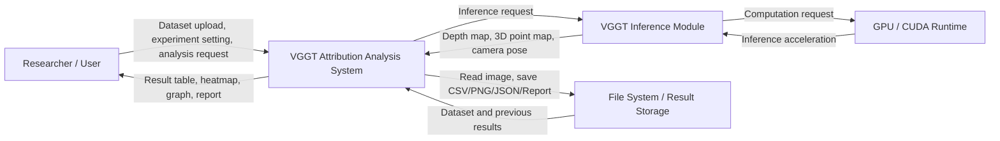

 22112053 최형규
 https://github.com/tirano11/VGGT
 

# Conceptualization Report

## VGGT 기반 3차원 기하 예측 기여도 분석 시스템

**Course**: CEM049 OSS Design  
**Phase**: Conceptualization  
**Project Title**: VGGT-Based 3D Geometric Prediction Attribution Analysis System  
**Author**: 최형규  
**Date**: 2026.06.05

---

## Table of Contents

1. Introduction  
2. Business Purpose  
3. System Scope  
4. System Context Diagram  
5. Use Case List  
6. Concepts of Operations  
7. Problem Statement  
8. Domain Entities  
9. High-Level Requirements  
10. Constraints and Assumptions  
11. Expected Benefits

---

## 1. Introduction

본 프로젝트는 순전파 기반 3차원 기하 비전 모델의 예측 결과를 분석하기 위한 **VGGT 기반 3차원 기하 예측 기여도 분석 시스템**을 개발하는 것을 목표로 한다.  

VGGT와 같은 3차원 기하 비전 모델은 입력 이미지로부터 깊이 지도, 3차원 점 지도, 카메라 자세와 같은 기하 정보를 직접 예측할 수 있다. 그러나 모델이 어떤 입력 시점 또는 어떤 이미지 영역에 근거하여 예측을 수행하는지는 명확하게 파악하기 어렵다. 본 시스템은 입력 이미지의 특정 패치 또는 특정 시점 영상을 흐림 처리한 뒤, 원본 예측 결과와 교란 후 예측 결과의 차이를 계산하여 입력 요소의 기여도를 분석한다.

본 프로젝트의 개발 대상은 VGGT 모델 자체가 아니라, VGGT 예측 결과를 기반으로 입력 교란 실험을 관리하고, 기여도 점수를 계산하며, 분석 결과를 시각화하고 저장하는 소프트웨어 시스템이다.

---

## 2. Business Purpose

### 2.1 Purpose

본 시스템의 목적은 연구자가 3차원 장면 재구성 모델의 예측 근거를 보다 쉽게 분석할 수 있도록 지원하는 것이다. 기존 3차원 재구성 모델은 높은 성능을 보이더라도, 특정 결과가 어떤 입력 영상 또는 어떤 국소 영역에 의해 크게 영향을 받았는지 확인하기 어렵다. 따라서 본 시스템은 입력 교란 기반 분석 절차를 자동화하여 모델의 입력 의존성과 예측 신뢰성을 정량적으로 확인할 수 있도록 한다.

### 2.2 Business Value

본 시스템이 제공하는 가치는 다음과 같다.

| 구분 | 내용 |
|---|---|
| 연구 효율 향상 | 반복적인 입력 교란 실험을 자동화하여 분석 시간을 줄인다. |
| 모델 해석 가능성 향상 | 특정 패치 또는 특정 시점 영상이 예측 결과에 미치는 영향을 수치와 시각 자료로 제공한다. |
| 실험 재현성 확보 | 실험 설정, 입력 데이터, 결과 점수, 시각화 결과를 파일로 저장하여 재현 가능한 분석을 지원한다. |
| 모델 비교 기반 제공 | 향후 VGGT뿐 아니라 DUSt3R, MASt3R 등 다른 3차원 기하 비전 모델과 비교할 수 있는 구조를 제공한다. |
| 교육 및 발표 활용 | 3차원 기하 예측 모델의 동작 근거를 표, 그래프, heatmap 형태로 보여주어 논문·수업 발표 자료로 활용할 수 있다. |

---

## 3. System Scope

### 3.1 In-Scope

본 프로젝트에서 개발할 시스템 범위는 다음과 같다.

1. 다중 시점 이미지 데이터셋 등록 기능
2. 실험 프로젝트 생성 및 관리 기능
3. VGGT 기준 예측 실행 요청 기능
4. 패치 단위 흐림 교란 실험 설정 기능
5. 시점 단위 흐림 교란 실험 설정 기능
6. 깊이 지도, 3차원 점 지도, 카메라 자세 변화량 계산 기능
7. total score 및 normalized score 계산 기능
8. 패치 기여도 heatmap 생성 기능
9. 시점별 기여도 그래프 생성 기능
10. 실험 결과 저장 및 보고서 출력 기능

### 3.2 Out-of-Scope

본 프로젝트에서 제외되는 범위는 다음과 같다.

1. VGGT 모델의 학습 기능
2. VGGT 모델 구조 자체의 수정 기능
3. 새로운 3차원 재구성 모델 개발
4. 대규모 데이터셋 수집 시스템 개발
5. 실시간 3차원 재구성 서비스 제공
6. 웹 기반 다중 사용자 서비스 운영

---

## 4. System Context Diagram

아래 다이어그램은 본 시스템과 외부 요소 간의 관계를 나타낸다.

### 4.1 External Actors and Systems

| Actor / External System | Description |
|---|---|
| Researcher / User | 실험을 생성하고, 이미지 데이터셋을 등록하며, 분석 결과를 확인하는 사용자이다. |
| VGGT Inference Module | 입력 이미지로부터 깊이 지도, 3차원 점 지도, 카메라 자세를 예측하는 외부 추론 모듈이다. |
| File System / Result Storage | 입력 이미지, 실험 설정, 예측 결과, 기여도 점수, 그래프, 보고서 파일을 저장하는 저장소이다. |
| GPU / CUDA Runtime | VGGT 추론 연산을 가속하기 위한 계산 환경이다. |

---

## 5. Use Case List

| Use Case ID | Use Case Name | Primary Actor | Summary | Priority |
|---|---|---|---|---|
| UC-01 | 프로젝트를 생성한다 | Researcher | 사용자는 새로운 분석 프로젝트를 생성하고 프로젝트 이름과 설명을 입력한다. | High |
| UC-02 | 데이터셋을 등록한다 | Researcher | 사용자는 다중 시점 이미지 폴더를 선택하여 분석 대상 데이터셋으로 등록한다. | High |
| UC-03 | 실험 설정을 입력한다 | Researcher | 사용자는 패치 격자 크기, 흐림 강도, 분석 대상 출력값, 저장 경로를 설정한다. | High |
| UC-04 | 기준 예측을 생성한다 | Researcher, VGGT Inference Module | 시스템은 원본 입력 이미지를 VGGT에 전달하여 기준 예측 결과를 생성한다. | High |
| UC-05 | 패치 단위 교란 실험을 수행한다 | Researcher, VGGT Inference Module | 시스템은 이미지의 특정 국소 영역을 흐림 처리하고 예측 변화량을 계산한다. | High |
| UC-06 | 시점 단위 교란 실험을 수행한다 | Researcher, VGGT Inference Module | 시스템은 특정 입력 시점 영상 전체를 흐림 처리하고 예측 변화량을 계산한다. | High |
| UC-07 | 기하 변화량을 계산한다 | System | 시스템은 depth map, 3D point map, camera pose 변화량을 계산한다. | High |
| UC-08 | 기여도 결과를 시각화한다 | Researcher | 시스템은 패치 기여도 heatmap, 시점별 score 그래프, 결과 표를 생성한다. | High |
| UC-09 | 실험 결과를 저장한다 | System, File System | 시스템은 실험 설정, 예측 결과, 점수, 이미지 결과물을 저장한다. | Medium |
| UC-10 | 분석 보고서를 출력한다 | Researcher | 사용자는 실험 결과를 정리한 보고서 파일을 생성한다. | Medium |
| UC-11 | 이전 실험 결과를 조회한다 | Researcher | 사용자는 과거 실험 목록과 결과 파일을 불러와 비교한다. | Medium |

---

## 6. Concepts of Operations

### 6.1 Normal Operation Scenario

1. 사용자는 시스템을 실행한다.
2. 사용자는 새로운 분석 프로젝트를 생성한다.
3. 사용자는 다중 시점 이미지 데이터셋 폴더를 등록한다.
4. 시스템은 등록된 이미지 목록과 기본 정보를 화면에 표시한다.
5. 사용자는 패치 격자 크기, 흐림 처리 방식, 분석 대상 출력값, 결과 저장 경로를 설정한다.
6. 사용자는 기준 예측 생성을 요청한다.
7. 시스템은 원본 입력 이미지를 VGGT Inference Module에 전달한다.
8. VGGT Inference Module은 깊이 지도, 3차원 점 지도, 카메라 자세 예측 결과를 반환한다.
9. 시스템은 기준 예측 결과를 저장한다.
10. 사용자는 패치 단위 또는 시점 단위 기여도 분석을 실행한다.
11. 시스템은 설정에 따라 입력 이미지의 특정 패치 또는 특정 시점 영상을 흐림 처리한다.
12. 시스템은 교란된 입력을 VGGT Inference Module에 전달하여 교란 후 예측 결과를 생성한다.
13. 시스템은 원본 예측 결과와 교란 후 예측 결과의 차이를 계산한다.
14. 시스템은 total score, normalized score, depth difference, point difference, pose difference를 산출한다.
15. 시스템은 결과를 표, 그래프, heatmap 형태로 시각화한다.
16. 사용자는 분석 결과를 확인하고 보고서 파일로 저장한다.

### 6.2 Alternative Scenario: 기준 예측 결과가 이미 존재하는 경우

1. 사용자는 기존 프로젝트를 선택한다.
2. 시스템은 저장된 기준 예측 결과가 있는지 확인한다.
3. 기준 예측 결과가 존재하면 시스템은 VGGT 기준 예측을 다시 수행하지 않고 저장된 결과를 불러온다.
4. 사용자는 바로 패치 단위 또는 시점 단위 교란 실험을 실행한다.

### 6.3 Exception Scenario: VGGT 추론 실패

1. 시스템이 VGGT Inference Module에 추론을 요청한다.
2. GPU 메모리 부족, 입력 이미지 오류, 모델 파일 누락 등의 이유로 추론이 실패한다.
3. 시스템은 오류 메시지와 실패 원인을 사용자에게 표시한다.
4. 시스템은 실패한 실험 상태를 저장하고, 사용자가 설정을 수정한 뒤 다시 실행할 수 있도록 한다.

### 6.4 Exception Scenario: 데이터셋 형식 오류

1. 사용자가 이미지 폴더를 등록한다.
2. 시스템은 폴더 내부의 이미지 파일 형식을 검사한다.
3. 지원하지 않는 확장자 또는 손상된 이미지가 포함된 경우 오류 메시지를 표시한다.
4. 사용자는 데이터셋을 수정하거나 다른 폴더를 선택한다.

---

## 7. Problem Statement

### 7.1 Problem

VGGT와 같은 순전파 기반 3차원 기하 비전 모델은 입력 이미지로부터 깊이 지도, 3차원 점 지도, 카메라 자세를 직접 예측할 수 있다. 그러나 사용자는 모델이 어떤 입력 이미지, 어떤 시점, 어떤 국소 영역을 근거로 3차원 기하 예측을 수행했는지 확인하기 어렵다. 이로 인해 모델 결과의 해석 가능성과 신뢰성 평가가 제한된다.

### 7.2 Affected Stakeholders

| Stakeholder | Problem |
|---|---|
| 3D Vision Researcher | 모델의 예측 근거를 분석하기 위해 반복적인 수동 실험을 수행해야 한다. |
| Developer | 입력 교란, 추론 실행, 점수 계산, 결과 시각화를 개별적으로 구현해야 한다. |
| Student / Presenter | 논문이나 발표에서 모델의 입력 의존성을 설명할 수 있는 시각 자료를 만들기 어렵다. |
| Reviewer / Evaluator | 모델이 특정 입력에 과도하게 의존하는지 확인하기 어렵다. |

### 7.3 Proposed Solution

본 프로젝트는 입력 교란 기반 기여도 분석 절차를 소프트웨어 시스템으로 구현한다. 사용자는 데이터셋과 실험 설정을 입력하고, 시스템은 원본 입력에 대한 기준 예측과 교란 입력에 대한 예측 결과를 비교하여 기여도 점수를 계산한다. 결과는 표, 그래프, heatmap, 보고서 형태로 제공된다.

### 7.4 Success Criteria

본 시스템은 다음 조건을 만족할 때 성공적으로 개발되었다고 판단한다.

1. 사용자가 이미지 데이터셋을 등록할 수 있다.
2. 원본 입력에 대한 기준 예측 결과를 생성하거나 불러올 수 있다.
3. 패치 단위 흐림 교란 실험을 수행할 수 있다.
4. 시점 단위 흐림 교란 실험을 수행할 수 있다.
5. depth map, 3D point map, camera pose 변화량을 계산할 수 있다.
6. total score 및 normalized score를 산출할 수 있다.
7. 결과를 heatmap, 그래프, 표 형태로 확인할 수 있다.
8. 실험 결과를 파일로 저장하고 보고서로 출력할 수 있다.

---

## 8. Domain Entities

| Entity | Description |
|---|---|
| Project | 하나의 분석 작업 단위이다. 데이터셋, 실험 설정, 결과 파일을 포함한다. |
| Dataset | 다중 시점 이미지들의 집합이다. |
| ImageView | 데이터셋에 포함된 하나의 시점 이미지이다. |
| ExperimentConfig | 패치 크기, 흐림 강도, 분석 대상 출력값, 저장 경로 등 실험 조건이다. |
| PerturbationTask | 특정 패치 또는 특정 시점 영상을 흐림 처리하는 교란 작업이다. |
| PredictionResult | VGGT가 출력한 depth map, 3D point map, camera pose 예측 결과이다. |
| MetricScore | 원본 예측과 교란 후 예측 사이의 변화량 점수이다. |
| AttributionResult | 입력 요소별 기여도 분석 결과이다. |
| VisualizationResult | heatmap, graph, table 등의 시각화 결과이다. |
| Report | 실험 설정과 분석 결과를 정리한 출력 문서이다. |

---

## 9. High-Level Requirements

### 9.1 Functional Requirements

| ID | Requirement |
|---|---|
| FR-01 | 시스템은 사용자가 분석 프로젝트를 생성할 수 있도록 해야 한다. |
| FR-02 | 시스템은 다중 시점 이미지 데이터셋을 등록할 수 있어야 한다. |
| FR-03 | 시스템은 실험 설정을 입력하고 저장할 수 있어야 한다. |
| FR-04 | 시스템은 VGGT Inference Module을 호출하여 기준 예측을 생성할 수 있어야 한다. |
| FR-05 | 시스템은 입력 이미지의 패치 단위 흐림 교란을 수행할 수 있어야 한다. |
| FR-06 | 시스템은 특정 시점 영상 전체에 대한 흐림 교란을 수행할 수 있어야 한다. |
| FR-07 | 시스템은 원본 예측과 교란 예측 사이의 기하 변화량을 계산할 수 있어야 한다. |
| FR-08 | 시스템은 입력 요소별 기여도 점수를 계산할 수 있어야 한다. |
| FR-09 | 시스템은 분석 결과를 heatmap, graph, table 형태로 시각화할 수 있어야 한다. |
| FR-10 | 시스템은 실험 결과를 파일로 저장할 수 있어야 한다. |
| FR-11 | 시스템은 분석 결과 보고서를 출력할 수 있어야 한다. |

### 9.2 Non-Functional Requirements

| ID | Requirement |
|---|---|
| NFR-01 | 시스템은 실험 설정과 결과를 재현 가능하게 저장해야 한다. |
| NFR-02 | 시스템은 오류 발생 시 사용자에게 명확한 오류 메시지를 제공해야 한다. |
| NFR-03 | 시스템은 실험 결과를 표와 그래프로 이해하기 쉽게 제공해야 한다. |
| NFR-04 | 시스템은 VGGT 외 다른 3차원 기하 비전 모델로 확장 가능한 구조를 가져야 한다. |
| NFR-05 | 시스템은 대용량 이미지와 예측 결과 파일을 안정적으로 관리해야 한다. |

---

## 10. Constraints and Assumptions

### 10.1 Constraints

1. VGGT 모델 추론에는 GPU 및 CUDA 환경이 필요할 수 있다.
2. 입력 데이터는 이미지 파일로 구성된 다중 시점 데이터셋이어야 한다.
3. VGGT 모델 자체의 학습 및 구조 변경은 본 프로젝트 범위에 포함하지 않는다.
4. 구현 단계에서는 수업 요구사항에 맞추어 Java 기반 애플리케이션 구조를 우선 고려한다.
5. 실제 VGGT 추론은 Python/PyTorch 기반 외부 모듈로 분리하여 연동할 수 있다.

### 10.2 Assumptions

1. 사용자는 분석할 이미지 데이터셋을 사전에 준비한다.
2. VGGT Inference Module은 정상적으로 설치되어 있다고 가정한다.
3. 입력 이미지의 순서는 사용자가 지정하거나 파일명 기준으로 정렬할 수 있다고 가정한다.
4. 실험 결과는 CSV, JSON, PNG, Markdown 또는 PDF 형식으로 저장할 수 있다고 가정한다.
5. 사용자는 분석 결과를 연구, 과제, 발표 자료 작성에 활용한다.

---

## 11. Expected Benefits

본 시스템을 통해 사용자는 VGGT 기반 3차원 기하 예측 결과가 입력 이미지의 어떤 요소에 크게 의존하는지 확인할 수 있다. 특히 패치 단위 분석을 통해 이미지 내부의 국소 영역별 중요도를 확인할 수 있고, 시점 단위 분석을 통해 다중 시점 입력에서 특정 시점이 결과에 미치는 영향을 비교할 수 있다. 또한 결과를 자동으로 저장하고 시각화함으로써 연구 결과 정리와 발표 자료 제작에 활용할 수 있다.

최종적으로 본 시스템은 3차원 기하 비전 모델의 해석 가능성과 신뢰성 평가를 지원하는 분석 도구로 활용될 수 있다.
