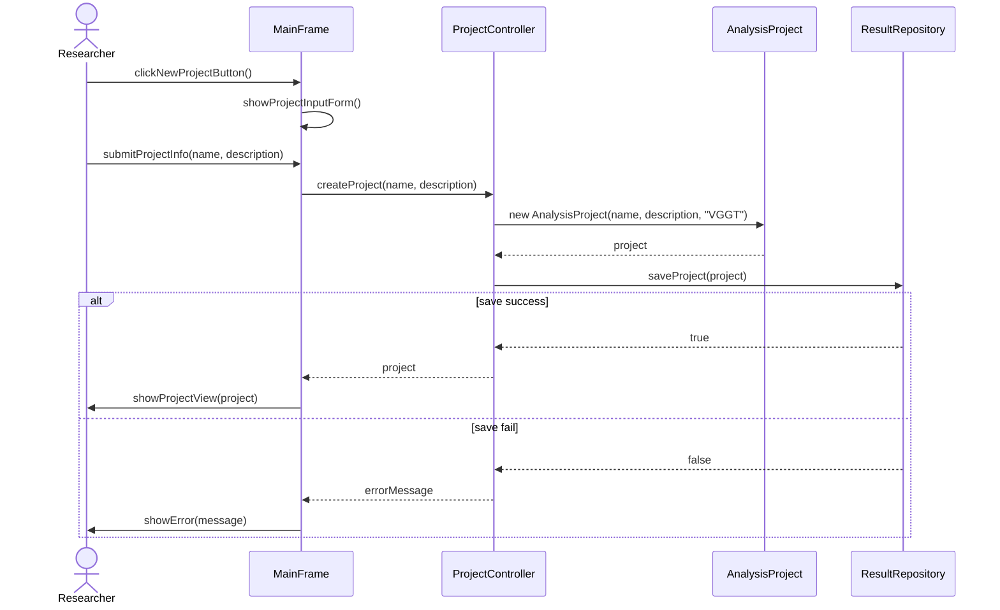
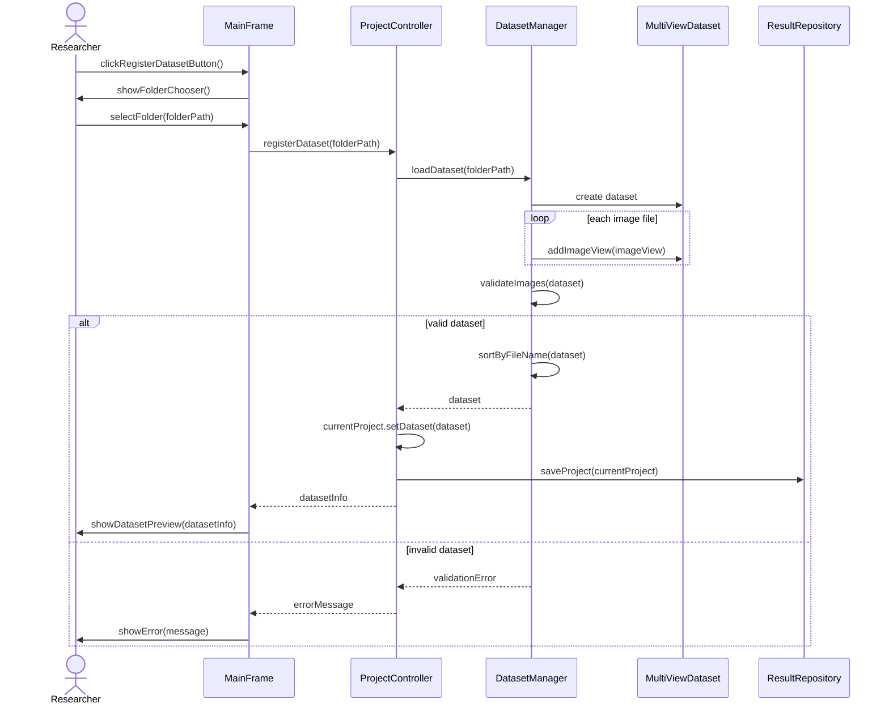
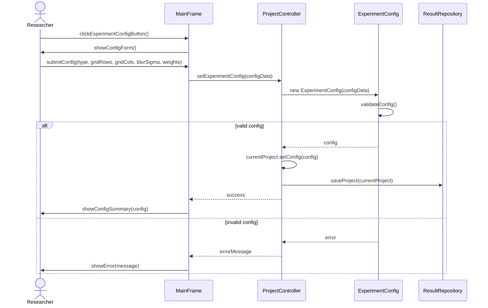
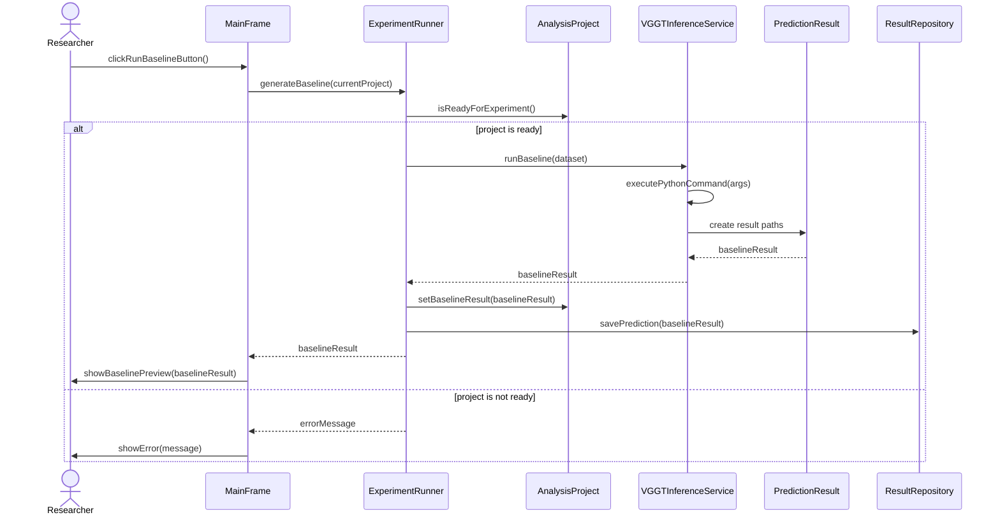
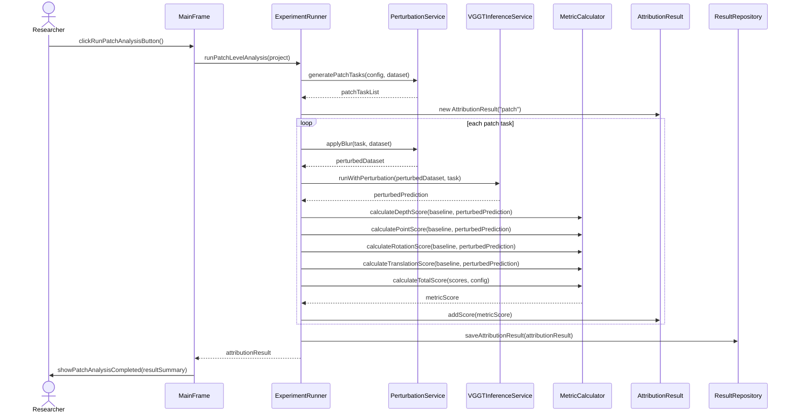
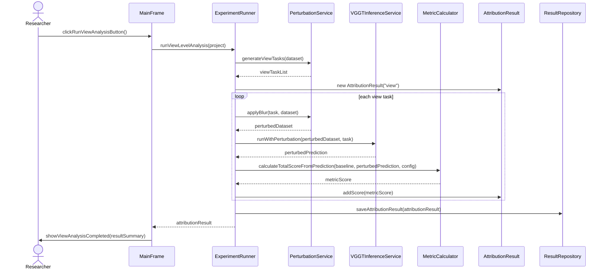
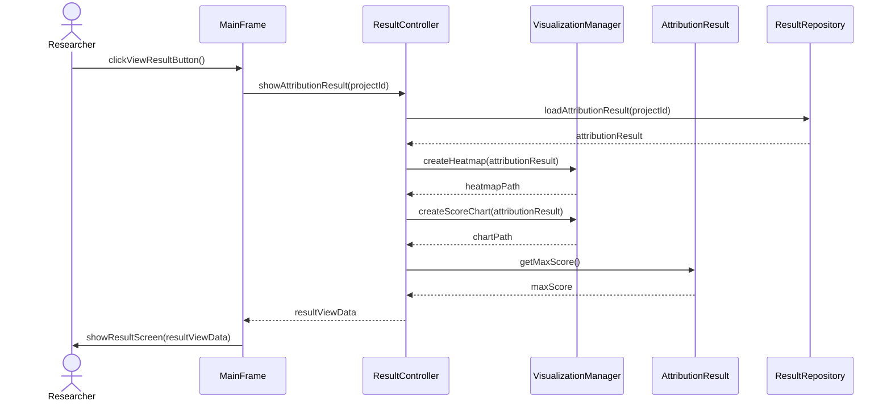
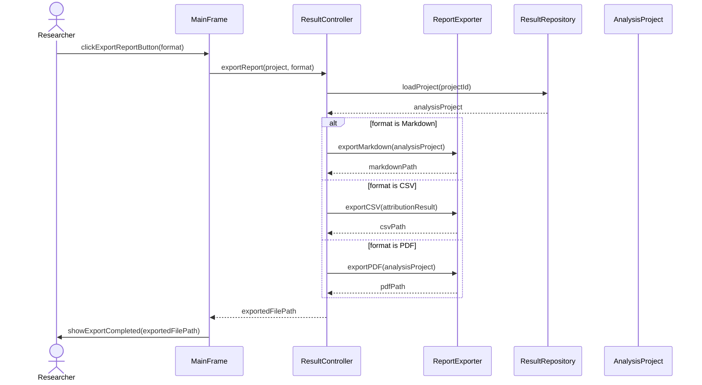
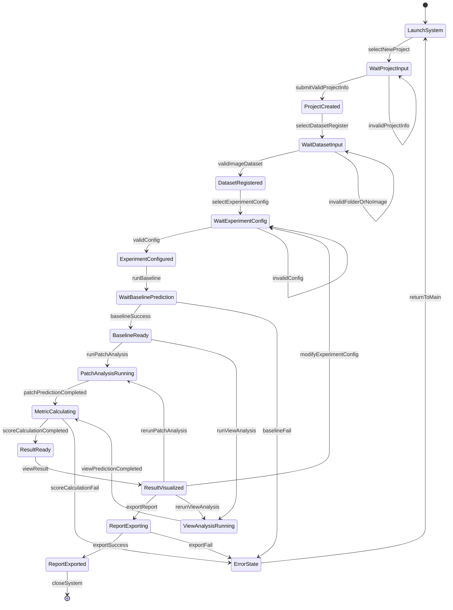

# VGGT Attribution Analyzer
## Design Document

**Student No.** [22112053]  
**Name** [최형규]  
**E-mail** [kgyu517@yu.ac.kr]  

**Project repository**  
[(https://github.com/tirano11/VGGT)]

\newpage

---

## Revision history

| Revision date | Version # | Description | Author |
|---|---:|---|---|
| 2026-06-05 | 1.0.0 | First draft of design document for VGGT-based 3D geometric prediction attribution analysis system | [최형규] |

---

## Contents

1. Introduction  
2. Class diagram  
   2.1 Class diagram  
   2.2 Class diagram description  
3. Sequence diagram  
   3.1 Create Analysis Project  
   3.2 Register Multi-view Dataset  
   3.3 Configure Attribution Experiment  
   3.4 Generate Baseline Prediction  
   3.5 Run Patch-level Attribution Analysis  
   3.6 Run View-level Attribution Analysis  
   3.7 View Attribution Result  
   3.8 Export Analysis Report  
4. State machine diagram  
   4.1 State machine diagram  
   4.2 State description  
5. Implementation requirements  
6. Glossary  
7. References  

\newpage

---

# 1. Introduction

VGGT Attribution Analyzer는 VGGT 기반 3차원 기하 예측 결과가 입력 영상의 어느 국소 영역 또는 어느 시점 영상에 의해 크게 영향을 받는지 분석하기 위한 소프트웨어 시스템이다. VGGT와 같은 순전파 기반 3차원 기하 비전 모델은 다중 시점 이미지를 입력받아 깊이 지도, 3차원 점 지도, 카메라 자세와 같은 기하 정보를 직접 예측할 수 있다. 그러나 이러한 모델이 특정 예측을 수행할 때 어떤 입력 정보에 의존하는지는 일반적인 출력 결과만으로는 확인하기 어렵다.

본 시스템은 사용자가 다중 시점 이미지 데이터셋을 등록하고, VGGT 모델을 이용해 원본 입력에 대한 기준 예측 결과를 생성한 뒤, 입력 영상의 특정 패치 또는 특정 시점 영상을 흐림 처리하여 교란 실험을 수행하도록 지원한다. 이후 원본 예측 결과와 교란 후 예측 결과를 비교하여 depth map 변화량, 3D point map 변화량, camera pose 변화량을 계산하고, 이를 기반으로 기여도 점수와 시각화 결과를 생성한다.

Design 단계에서는 Analysis 단계에서 정의한 기능 요구사항을 실제 구현 가능한 구조로 구체화한다. 따라서 본 문서는 VGGT Attribution Analyzer의 주요 설계 클래스, 각 클래스의 속성과 연산, 주요 기능별 Sequence Diagram, 시스템 전체의 State Machine Diagram, 구현 환경 요구사항을 포함한다. 본 문서의 세부 설계는 실제 Java 기반 관리 애플리케이션과 Python 기반 VGGT 분석 모듈을 연동하는 구조를 기준으로 작성하였다.

본 시스템의 구현 방향은 Java 애플리케이션이 사용자의 프로젝트 생성, 데이터셋 등록, 실험 설정, 결과 조회 및 보고서 출력 기능을 담당하고, Python/PyTorch 기반 VGGT 분석 모듈이 실제 모델 추론과 입력 교란 실험을 수행하는 구조이다. 이를 통해 수업 프로젝트의 Java 구현 요구를 만족하면서도, 실제 VGGT 모델 실행에 필요한 Python 기반 딥러닝 환경을 함께 활용할 수 있다.

\newpage

---

# 2. Class diagram

## 2.1 Class diagram

아래의 그림은 VGGT Attribution Analyzer 시스템의 Class Diagram을 표현한 그림이다. 시스템은 사용자 인터페이스 계층, 프로젝트 관리 계층, 실험 실행 계층, 결과 저장 및 출력 계층으로 나누어 설계하였다.

```mermaid
classDiagram
    class MainFrame {
        -ProjectController projectController
        -ResultController resultController
        +showMainMenu() void
        +showProjectView(project: AnalysisProject) void
        +showError(message: String) void
    }

    class ProjectController {
        -AnalysisProject currentProject
        -DatasetManager datasetManager
        -ResultRepository repository
        +createProject(name: String, description: String) AnalysisProject
        +loadProject(projectId: String) AnalysisProject
        +saveProject(project: AnalysisProject) boolean
        +getCurrentProject() AnalysisProject
    }

    class AnalysisProject {
        -String projectId
        -String projectName
        -String description
        -String modelName
        -MultiViewDataset dataset
        -ExperimentConfig config
        -PredictionResult baselineResult
        -AttributionResult attributionResult
        +setDataset(dataset: MultiViewDataset) void
        +setConfig(config: ExperimentConfig) void
        +isReadyForExperiment() boolean
    }

    class DatasetManager {
        +loadDataset(folderPath: String) MultiViewDataset
        +validateImages(dataset: MultiViewDataset) boolean
        +sortByFileName(dataset: MultiViewDataset) MultiViewDataset
    }

    class MultiViewDataset {
        -String datasetId
        -String folderPath
        -List~ImageView~ imageViews
        +addImageView(image: ImageView) void
        +getImageCount() int
        +getImageViews() List~ImageView~
    }

    class ImageView {
        -int viewIndex
        -String fileName
        -String filePath
        -int width
        -int height
        +getViewIndex() int
        +getFilePath() String
    }

    class ExperimentConfig {
        -String experimentType
        -int gridRows
        -int gridCols
        -double blurSigma
        -double lambdaDepth
        -double lambdaPoint
        -double lambdaRotation
        -double lambdaTranslation
        +isPatchLevel() boolean
        +isViewLevel() boolean
        +getPatchCount() int
    }

    class VGGTInferenceService {
        -String pythonPath
        -String scriptPath
        -String modelPath
        +runBaseline(dataset: MultiViewDataset) PredictionResult
        +runWithPerturbation(dataset: MultiViewDataset, task: PerturbationTask) PredictionResult
        +executePythonCommand(args: List~String~) boolean
    }

    class PerturbationTask {
        -String taskId
        -String taskType
        -int targetViewIndex
        -int patchIndex
        -String outputFolder
        +buildPatchTask(viewIndex: int, patchIndex: int) PerturbationTask
        +buildViewTask(viewIndex: int) PerturbationTask
    }

    class PerturbationService {
        +generatePatchTasks(config: ExperimentConfig, dataset: MultiViewDataset) List~PerturbationTask~
        +generateViewTasks(dataset: MultiViewDataset) List~PerturbationTask~
        +applyBlur(task: PerturbationTask, dataset: MultiViewDataset) MultiViewDataset
    }

    class PredictionResult {
        -String resultId
        -String depthMapPath
        -String pointMapPath
        -String cameraPosePath
        -String glbPath
        +hasDepthMap() boolean
        +hasPointMap() boolean
        +hasCameraPose() boolean
    }

    class MetricCalculator {
        +calculateDepthScore(base: PredictionResult, perturbed: PredictionResult) double
        +calculatePointScore(base: PredictionResult, perturbed: PredictionResult) double
        +calculateRotationScore(base: PredictionResult, perturbed: PredictionResult) double
        +calculateTranslationScore(base: PredictionResult, perturbed: PredictionResult) double
        +calculateTotalScore(scores: MetricScore, config: ExperimentConfig) double
    }

    class MetricScore {
        -double depthScore
        -double pointScore
        -double rotationScore
        -double translationScore
        -double totalScore
        -double normalizedScore
        +getTotalScore() double
        +getNormalizedScore() double
    }

    class AttributionResult {
        -String resultId
        -String analysisType
        -List~MetricScore~ scoreList
        -String heatmapPath
        -String chartPath
        -String csvPath
        +addScore(score: MetricScore) void
        +getMaxScore() MetricScore
        +getMeanScore() double
    }

    class ExperimentRunner {
        -VGGTInferenceService inferenceService
        -PerturbationService perturbationService
        -MetricCalculator metricCalculator
        +runPatchLevelAnalysis(project: AnalysisProject) AttributionResult
        +runViewLevelAnalysis(project: AnalysisProject) AttributionResult
        +runSingleTask(project: AnalysisProject, task: PerturbationTask) MetricScore
    }

    class ResultController {
        -VisualizationManager visualizationManager
        -ReportExporter reportExporter
        +showAttributionResult(result: AttributionResult) void
        +exportReport(project: AnalysisProject, format: String) boolean
    }

    class VisualizationManager {
        +createHeatmap(result: AttributionResult) String
        +createScoreChart(result: AttributionResult) String
        +createReconstructionPreview(prediction: PredictionResult) String
    }

    class ReportExporter {
        +exportMarkdown(project: AnalysisProject) String
        +exportCSV(result: AttributionResult) String
        +exportPDF(project: AnalysisProject) String
    }

    class ResultRepository {
        -String rootPath
        +saveProject(project: AnalysisProject) boolean
        +savePrediction(result: PredictionResult) boolean
        +saveAttributionResult(result: AttributionResult) boolean
        +loadProject(projectId: String) AnalysisProject
    }

    MainFrame --> ProjectController
    MainFrame --> ResultController
    ProjectController --> AnalysisProject
    ProjectController --> DatasetManager
    ProjectController --> ResultRepository
    DatasetManager --> MultiViewDataset
    MultiViewDataset "1" --> "*" ImageView
    AnalysisProject "1" --> "1" MultiViewDataset
    AnalysisProject "1" --> "1" ExperimentConfig
    AnalysisProject "1" --> "0..1" PredictionResult
    AnalysisProject "1" --> "0..1" AttributionResult
    ExperimentRunner --> VGGTInferenceService
    ExperimentRunner --> PerturbationService
    ExperimentRunner --> MetricCalculator
    ExperimentRunner --> PerturbationTask
    ExperimentRunner --> AttributionResult
    VGGTInferenceService --> PredictionResult
    MetricCalculator --> MetricScore
    AttributionResult "1" --> "*" MetricScore
    ResultController --> VisualizationManager
    ResultController --> ReportExporter
    ResultController --> AttributionResult
    VisualizationManager --> AttributionResult
    ReportExporter --> AnalysisProject
    ResultRepository --> AnalysisProject
    ResultRepository --> PredictionResult
    ResultRepository --> AttributionResult
```

## 2.2 Class diagram description

아래의 표는 위의 Class Diagram에서 표현한 Class들에 대한 설명이다.

| Class Name | Explanation |
|---|---|
| `MainFrame` | 시스템의 메인 UI를 담당하는 클래스이다. 사용자는 이 화면에서 프로젝트 생성, 데이터셋 등록, 실험 실행, 결과 조회, 보고서 출력 기능으로 이동한다. `showMainMenu()`는 메인 메뉴를 출력하고, `showProjectView()`는 선택된 프로젝트 화면을 표시한다. |
| `ProjectController` | 분석 프로젝트의 생성, 불러오기, 저장을 제어하는 컨트롤러 클래스이다. 현재 작업 중인 `AnalysisProject`를 관리하며, `DatasetManager`와 `ResultRepository`를 통해 데이터셋과 프로젝트 파일을 연결한다. |
| `AnalysisProject` | 하나의 VGGT 기여도 분석 프로젝트를 표현하는 핵심 클래스이다. 프로젝트 이름, 설명, 분석 대상 모델, 데이터셋, 실험 설정, 기준 예측 결과, 기여도 분석 결과를 포함한다. `isReadyForExperiment()`는 데이터셋과 실험 설정이 모두 준비되었는지 확인한다. |
| `DatasetManager` | 사용자가 선택한 이미지 폴더를 읽어 다중 시점 이미지 데이터셋으로 변환하는 클래스이다. 이미지 형식 검증, 파일명 기준 정렬, 이미지 개수 확인 등의 작업을 수행한다. |
| `MultiViewDataset` | 다중 시점 이미지 집합을 표현하는 클래스이다. 하나의 데이터셋은 여러 개의 `ImageView` 객체를 포함하며, VGGT 모델의 입력으로 사용된다. |
| `ImageView` | 하나의 입력 시점 이미지를 표현하는 클래스이다. 시점 인덱스, 파일명, 파일 경로, 이미지 크기 정보를 가진다. 시점 단위 교란 실험에서는 `viewIndex`를 기준으로 특정 이미지를 선택한다. |
| `ExperimentConfig` | 기여도 분석 실험 조건을 저장하는 클래스이다. 패치 격자 크기, 흐림 강도, 실험 유형, depth/point/rotation/translation score의 가중치를 포함한다. |
| `VGGTInferenceService` | Python/PyTorch 기반 VGGT 추론 스크립트를 실행하는 클래스이다. Java 애플리케이션에서 Python 명령을 호출하여 기준 예측 또는 교란 입력 예측을 수행한다. |
| `PerturbationTask` | 하나의 교란 실험 단위를 표현하는 클래스이다. 패치 단위 실험에서는 대상 시점과 패치 번호를 저장하고, 시점 단위 실험에서는 대상 시점 번호를 저장한다. |
| `PerturbationService` | 실험 설정에 따라 여러 개의 `PerturbationTask`를 생성하고, 선택된 입력 영역이나 시점 영상에 흐림 처리를 적용하는 클래스이다. |
| `PredictionResult` | VGGT 모델의 예측 결과를 표현하는 클래스이다. depth map, 3D point map, camera pose, GLB 시각화 결과의 저장 경로를 가진다. |
| `MetricCalculator` | 원본 예측 결과와 교란 후 예측 결과 사이의 기하학적 차이를 계산하는 클래스이다. depth score, point score, rotation score, translation score, total score를 계산한다. |
| `MetricScore` | 하나의 교란 실험에 대한 수치 결과를 저장하는 클래스이다. 각 기하 변화량과 최종 기여도 점수, 정규화 점수를 포함한다. |
| `AttributionResult` | 전체 기여도 분석 결과를 저장하는 클래스이다. 여러 `MetricScore` 목록, heatmap 경로, chart 경로, CSV 결과 파일 경로를 포함한다. |
| `ExperimentRunner` | 기여도 분석 실험의 전체 실행 흐름을 담당하는 클래스이다. 패치 단위 분석과 시점 단위 분석을 수행하고, 각 교란 실험의 score를 계산하여 `AttributionResult`로 통합한다. |
| `ResultController` | 분석 결과 조회와 보고서 출력을 제어하는 클래스이다. `VisualizationManager`를 통해 결과 화면을 구성하고, `ReportExporter`를 통해 결과 파일을 생성한다. |
| `VisualizationManager` | 기여도 분석 결과를 heatmap, score chart, 3D reconstruction preview 형태로 시각화하는 클래스이다. |
| `ReportExporter` | 분석 결과를 Markdown, CSV, PDF 등으로 출력하는 클래스이다. 최종 보고서에는 실험 설정, 기준 예측 결과, 기여도 점수, 시각화 결과가 포함된다. |
| `ResultRepository` | 프로젝트, 예측 결과, 분석 결과를 로컬 파일 시스템에 저장하고 불러오는 클래스이다. 데이터베이스를 사용하지 않는 경우 JSON, CSV, PNG, GLB 파일 기반으로 결과를 관리한다. |

\newpage

---

# 3. Sequence diagram

아래에 나오는 그림들은 Analysis 단계에서 정의한 주요 기능들을 Sequence Diagram으로 표현한 것이다. 각 Sequence Diagram은 사용자의 요청이 어떤 클래스와 메소드 호출을 통해 처리되는지 보여준다.

## 3.1 Create Analysis Project

아래의 그림은 사용자가 새로운 분석 프로젝트를 생성할 때의 Sequence Diagram이다.

사용자가 `New Project` 버튼을 누르면 `MainFrame`은 프로젝트 입력 화면을 표시한다. 사용자가 프로젝트 이름과 설명을 입력하면 `ProjectController`가 `AnalysisProject` 객체를 생성하고 `ResultRepository`에 저장한다. 저장이 성공하면 프로젝트 화면으로 이동하고, 실패하면 오류 메시지를 출력한다.

---

## 3.2 Register Multi-view Dataset

아래의 그림은 사용자가 다중 시점 이미지 데이터셋을 등록할 때의 Sequence Diagram이다.

사용자가 이미지 폴더를 선택하면 `DatasetManager`는 폴더 내부의 이미지 파일을 읽고 `MultiViewDataset` 객체를 생성한다. 시스템은 이미지 개수, 파일명, 입력 순서, 해상도 정보를 확인한 뒤 프로젝트에 데이터셋을 등록한다.

---

## 3.3 Configure Attribution Experiment

아래의 그림은 사용자가 기여도 분석 실험 조건을 설정할 때의 Sequence Diagram이다.

사용자는 실험 유형을 패치 단위 또는 시점 단위로 선택하고, 패치 격자 크기, 흐림 강도, 기하 변화량 가중치를 입력한다. `ExperimentConfig`는 입력된 설정값을 검증하고, 유효한 경우 프로젝트에 저장한다.

---

## 3.4 Generate Baseline Prediction

아래의 그림은 원본 다중 시점 이미지에 대한 VGGT 기준 예측 결과를 생성할 때의 Sequence Diagram이다.

기준 예측은 모든 교란 실험의 비교 기준이 된다. `VGGTInferenceService`는 Java 애플리케이션에서 Python VGGT 추론 스크립트를 실행하고, 생성된 depth map, point map, camera pose, GLB 파일 경로를 `PredictionResult`에 저장한다.

---

## 3.5 Run Patch-level Attribution Analysis

아래의 그림은 입력 영상의 국소 패치 단위로 기여도 분석을 수행할 때의 Sequence Diagram이다.

패치 단위 분석에서는 `PerturbationService`가 입력 영상을 설정된 격자 크기로 나누고, 각 패치에 대해 흐림 처리 작업을 생성한다. 각 교란 입력은 VGGT 모델에 다시 입력되고, `MetricCalculator`가 원본 예측과 교란 예측 사이의 기하학적 변화량을 계산한다.

---

## 3.6 Run View-level Attribution Analysis

아래의 그림은 입력 시점 영상 전체를 흐림 처리하여 시점 단위 기여도 분석을 수행할 때의 Sequence Diagram이다.

시점 단위 분석에서는 특정 입력 시점 영상을 제거하지 않고 전체 흐림 처리한다. 이를 통해 입력 개수와 입력 순서를 유지하면서 특정 시점 영상이 VGGT 예측 결과에 미치는 영향을 분석할 수 있다.

---

## 3.7 View Attribution Result

아래의 그림은 사용자가 기여도 분석 결과를 확인할 때의 Sequence Diagram이다.

사용자가 결과 조회를 선택하면 `ResultController`는 저장된 기여도 결과를 불러온다. 이후 `VisualizationManager`가 heatmap과 score chart를 생성하고, 최대 기여도 점수와 평균 점수 등을 결과 화면에 표시한다.

---

## 3.8 Export Analysis Report

아래의 그림은 분석 결과를 보고서 파일로 출력할 때의 Sequence Diagram이다.

보고서 출력 기능은 실험 설정, 데이터셋 정보, 기준 예측 결과, 패치 단위 또는 시점 단위 기여도 점수, heatmap, chart를 하나의 파일로 저장한다. 사용자는 Markdown, CSV, PDF 형식 중 필요한 형식을 선택할 수 있다.

\newpage

---

# 4. State machine diagram

## 4.1 State machine diagram

아래의 그림은 VGGT Attribution Analyzer 시스템의 State Machine Diagram을 표현한 그림이다. 시스템은 프로젝트 생성부터 데이터셋 등록, 실험 설정, 기준 예측, 기여도 분석, 결과 시각화, 보고서 출력까지의 상태를 가진다.

## 4.2 State description

아래는 위의 State Machine Diagram에 나온 각 State들에 대한 설명이다.

| Status | Explanation |
|---|---|
| `LaunchSystem` | 시스템이 실행된 초기 상태이다. 사용자는 이 상태에서 새 프로젝트를 생성하거나 기존 프로젝트를 불러올 수 있다. |
| `WaitProjectInput` | 사용자가 프로젝트 이름, 설명, 분석 대상 모델 정보를 입력하는 상태이다. 필수 입력값이 누락되면 같은 상태에 머무른다. |
| `ProjectCreated` | 분석 프로젝트가 정상적으로 생성된 상태이다. 프로젝트는 `ResultRepository`에 저장되며, 다음 단계로 데이터셋 등록이 가능하다. |
| `WaitDatasetInput` | 사용자가 다중 시점 이미지 폴더를 선택하는 상태이다. 이미지가 없거나 지원하지 않는 형식만 포함된 경우 다시 폴더 선택을 요구한다. |
| `DatasetRegistered` | 다중 시점 이미지 데이터셋이 프로젝트에 등록된 상태이다. 이미지 개수, 파일명, 입력 순서, 해상도 정보가 프로젝트에 저장된다. |
| `WaitExperimentConfig` | 사용자가 패치 격자 크기, 흐림 강도, 실험 유형, 기하 변화량 가중치 등을 설정하는 상태이다. |
| `ExperimentConfigured` | 실험 설정값이 유효하게 저장된 상태이다. 이 상태부터 기준 예측 생성이 가능하다. |
| `WaitBaselinePrediction` | VGGT 모델이 원본 입력 영상에 대한 기준 예측을 생성하는 상태이다. 이 과정에서 Python VGGT 스크립트가 실행된다. |
| `BaselineReady` | 기준 예측 결과가 생성된 상태이다. depth map, 3D point map, camera pose, GLB 시각화 파일이 저장된다. |
| `PatchAnalysisRunning` | 패치 단위 흐림 교란 실험이 실행 중인 상태이다. 각 시점 영상의 각 패치에 대해 반복적으로 교란 입력을 생성하고 VGGT 추론을 수행한다. |
| `ViewAnalysisRunning` | 시점 단위 흐림 교란 실험이 실행 중인 상태이다. 각 입력 시점 영상을 하나씩 전체 흐림 처리하여 VGGT 추론을 수행한다. |
| `MetricCalculating` | 원본 예측과 교란 후 예측 사이의 depth, point, rotation, translation 변화량을 계산하는 상태이다. |
| `ResultReady` | 전체 기여도 점수가 계산되어 `AttributionResult`가 생성된 상태이다. |
| `ResultVisualized` | 기여도 결과가 heatmap, score chart, table 형태로 시각화되어 사용자에게 표시된 상태이다. |
| `ReportExporting` | 사용자가 선택한 형식에 따라 분석 보고서를 생성하는 상태이다. Markdown, CSV, PDF 출력이 가능하다. |
| `ReportExported` | 보고서 출력이 완료된 상태이다. 사용자는 저장된 파일 경로를 확인하고 시스템을 종료할 수 있다. |
| `ErrorState` | 프로젝트 저장 실패, 데이터셋 오류, VGGT 실행 실패, score 계산 실패, 보고서 출력 실패 등이 발생한 상태이다. 사용자는 메인 화면으로 돌아가거나 설정을 수정할 수 있다. |

\newpage

---

# 5. Implementation requirements

VGGT Attribution Analyzer 시스템을 구동하기 위해 필요한 요구사항은 아래와 같다.

## 5.1 Hardware Requirements

| Item | Minimum Requirement | Recommended Requirement |
|---|---|---|
| CPU | Intel Core i5 또는 AMD Ryzen 5 이상 | Intel Core i7/i9 또는 AMD Ryzen 7/9 이상 |
| RAM | 16GB 이상 | 32GB 이상 |
| GPU | NVIDIA CUDA 지원 GPU | NVIDIA RTX 계열 GPU, VRAM 12GB 이상 |
| Storage | 20GB 이상의 여유 공간 | 50GB 이상의 여유 공간 |
| Network | 초기 모델 다운로드 및 패키지 설치 시 필요 | 실험 실행 자체는 오프라인 수행 가능 |

## 5.2 Software Requirements

| Item | Requirement |
|---|---|
| Operating System | Windows 10/11 또는 Ubuntu 22.04 이상 |
| Main Application Language | Java 17 이상 |
| Analysis Module Language | Python 3.10 이상 |
| Deep Learning Framework | PyTorch with CUDA support |
| 3D Geometry Model | VGGT official implementation |
| Build Tool | Gradle 또는 Maven |
| Version Control | Git, GitHub |
| Output Format | Markdown, CSV, PNG, GLB, PDF |

## 5.3 Nonfunctional Requirements

| Category | Requirement |
|---|---|
| Performance | 데이터셋 목록 로딩은 100개 이하 이미지 기준 3초 이내에 수행되어야 한다. 단, VGGT 추론 시간은 GPU 성능과 입력 이미지 수에 따라 달라질 수 있다. |
| Reliability | 실험 중 오류가 발생하더라도 기존 프로젝트 정보와 기준 예측 결과는 손상되지 않아야 한다. |
| Usability | 사용자는 프로젝트 생성, 데이터셋 등록, 실험 설정, 분석 실행, 결과 조회, 보고서 출력 단계를 순서대로 이해할 수 있어야 한다. |
| Maintainability | VGGT 외에 DUSt3R, MASt3R 등 다른 3차원 기하 비전 모델을 추가할 수 있도록 추론 서비스를 모듈화해야 한다. |
| Compatibility | Java 관리 애플리케이션과 Python 분석 모듈은 파일 기반 인터페이스(JSON, CSV, PNG, GLB)를 통해 연결한다. |
| Traceability | 각 실험 결과는 사용된 데이터셋, 입력 순서, 실험 설정, 교란 대상, score 계산 결과와 함께 저장되어야 한다. |
| Security | 사용자가 선택한 로컬 이미지 경로와 실험 결과는 사용자의 명시적 요청 없이 외부 서버로 전송하지 않는다. |

## 5.4 Implementation Notes

본 시스템은 전체 VGGT 모델을 Java로 직접 구현하지 않는다. Java 애플리케이션은 사용자 인터페이스와 프로젝트 관리 기능을 담당하고, Python 분석 모듈은 VGGT 모델 추론과 입력 교란 실험을 담당한다. Java와 Python 모듈은 명령행 호출과 결과 파일을 통해 연동된다.

예를 들어 Java의 `VGGTInferenceService`는 Python 스크립트 실행 명령을 생성하고, Python 모듈은 입력 이미지 폴더와 실험 설정 파일을 읽어 VGGT 추론을 수행한다. 이후 결과는 depth map, point map, camera pose, GLB, CSV, PNG 파일로 저장되며, Java 애플리케이션은 해당 결과 파일을 읽어 사용자에게 표시한다.

\newpage

---

# 6. Glossary

용어사전에 대한 내용은 다음 표와 같다.

| Terms | Description |
|---|---|
| VGGT | Visual Geometry Grounded Transformer의 약어로, 입력 이미지로부터 카메라 매개변수, 깊이 지도, 3차원 점 지도 등을 예측하는 3차원 기하 비전 모델이다. |
| VGGT Attribution Analyzer | VGGT 모델의 3차원 기하 예측 결과가 입력 영상의 어느 영역이나 시점에 의해 영향을 받는지 분석하는 시스템이다. |
| 3D Geometry Vision Model | 입력 영상으로부터 depth map, 3D point map, camera pose 등 3차원 기하 정보를 예측하는 비전 모델이다. |
| Multi-view Dataset | 동일한 장면을 여러 시점에서 촬영한 이미지들의 집합이다. |
| ImageView | 다중 시점 데이터셋에 포함된 하나의 입력 시점 영상이다. |
| Baseline Prediction | 원본 입력 영상 집합을 모델에 입력했을 때 생성되는 기준 예측 결과이다. |
| Perturbation | 입력 영상의 특정 부분을 흐림 처리하거나 약화시켜 모델 예측 변화량을 관찰하는 실험 방식이다. |
| Blur Masking | 입력 영역을 검은색으로 제거하지 않고 흐림 처리하여 세부 정보를 약화시키는 방식이다. |
| Patch-level Attribution | 입력 영상 내부를 격자로 나누고 특정 패치만 교란하여 국소 영역의 기여도를 분석하는 방식이다. |
| View-level Attribution | 특정 입력 시점 영상 전체를 흐림 처리하여 해당 시점이 예측 결과에 미치는 영향을 분석하는 방식이다. |
| Depth Map | 영상의 각 픽셀에 대응하는 깊이 정보를 나타내는 지도이다. |
| 3D Point Map | 각 픽셀에 대응하는 3차원 좌표 정보를 나타내는 지도이다. |
| Camera Pose | 카메라의 위치와 방향을 나타내는 기하 정보이다. 일반적으로 회전 행렬과 이동 벡터로 표현한다. |
| Metric Score | 원본 예측과 교란 예측 사이의 depth, point, rotation, translation 변화량을 수치화한 값이다. |
| Attribution Result | 전체 교란 실험을 통해 계산된 입력 요소별 기여도 분석 결과이다. |
| Heatmap | 입력 이미지 위에 기여도 점수의 공간적 분포를 색상으로 표시한 시각화 결과이다. |
| GLB | 3차원 재구성 결과를 저장하고 시각화하기 위한 3D 파일 형식이다. |
| Java | 본 시스템의 메인 애플리케이션 구현에 사용하는 프로그래밍 언어이다. |
| Python | VGGT 모델 추론과 입력 교란 분석 모듈 구현에 사용하는 프로그래밍 언어이다. |
| PyTorch | VGGT 모델 실행을 위해 사용하는 딥러닝 프레임워크이다. |

\newpage

---

# 7. References

1. Jianyuan Wang, Minghao Chen, Nikita Karaev, Andrea Vedaldi, Christian Rupprecht, and David Novotny, “VGGT: Visual Geometry Grounded Transformer,” Proceedings of the Computer Vision and Pattern Recognition Conference, 2025.
2. Shuzhe Wang et al., “DUSt3R: Geometric 3D Vision Made Easy,” Proceedings of the IEEE/CVF Conference on Computer Vision and Pattern Recognition, 2024.
3. Vincent Leroy, Yohann Cabon, and Jérôme Revaud, “Grounding Image Matching in 3D with MASt3R,” European Conference on Computer Vision, 2024.
4. Ruth C. Fong and Andrea Vedaldi, “Interpretable Explanations of Black Boxes by Meaningful Perturbation,” Proceedings of the IEEE International Conference on Computer Vision, 2017.
5. Sarthak Jain and Byron C. Wallace, “Attention is not Explanation,” Proceedings of NAACL-HLT, 2019.
6. Alan Dennis, Barbara Haley Wixom, and David Tegarden, *Systems Analysis and Design with UML: An Object-Oriented Approach*, 5th edition, Wiley.
7. Grady Booch, James Rumbaugh, and Ivar Jacobson, *Unified Modeling Language User Guide*, 2nd Edition, Addison-Wesley Professional.
8. Oracle, *Java Platform, Standard Edition Documentation*.
9. PyTorch Team, *PyTorch Documentation*.
10. Facebook Research, *VGGT Official GitHub Repository*.
